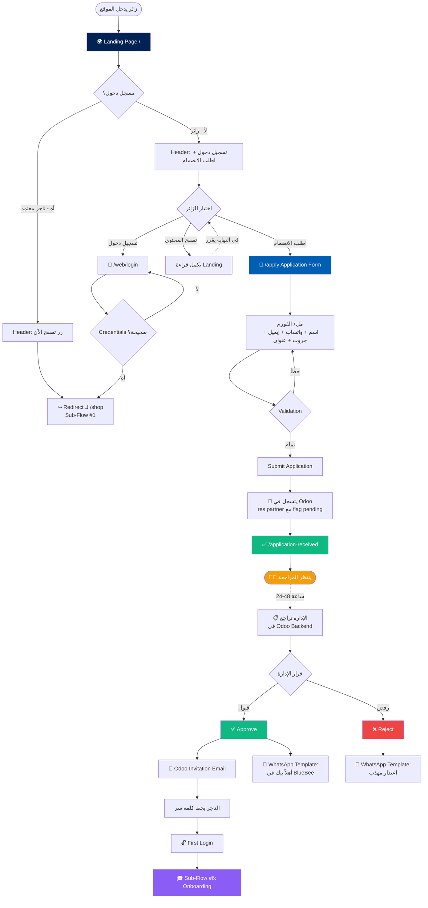

# 🌍 Sub-Flow #0: صفحة الهبوط وطلب الانضمام (Landing & Application)

> **Project:** BlueBee-Eg B2B Wholesale Platform
> **Module:** `invoice_deadline` (Odoo 17)
> **Phase:** 1 — UX Planning
> **Status:** 🟢 Draft — Pending Sherif Approval
> **Date:** May 2026
> **Scope:** الصفحة العامة (public landing) للزوار + فورم طلب الانضمام + رحلة المراجعة الإدارية. الهوم المحمي للتجار في `01_home.md` (منفصل).
> **Scope note:** Public landing page for visitors + Application form + Admin review journey. Protected merchant home is in `01_home.md` (separate).

---

## 📋 جدول المحتويات | Table of Contents

1. [الهدف من الصفحة](#الهدف)
2. [النطاق والربط مع 01](#النطاق)
3. [القرارات المعمارية](#القرارات-المعمارية)
4. [Information Architecture](#information-architecture)
5. [Sub-Flow Diagram](#sub-flow-diagram)
6. [Wireframes — Landing](#wireframes-landing)
7. [Wireframes — Application Form](#wireframes-application)
8. [Wireframes — Confirmation Page](#wireframes-confirmation)
9. [Admin Review Flow](#admin-review-flow)
10. [Acceptance & Rejection Workflow](#acceptance-rejection)
11. [Edge Cases](#edge-cases)
12. [Inputs لـ Claude Design](#inputs-لـ-claude-design)
13. [Inputs لـ Claude Code](#inputs-لـ-claude-code)

---

<a name="الهدف"></a>
## 🎯 الهدف من الصفحة | Page Goal

الـ Landing مش مجرد "صفحة ترحيب" — هي **بوابة BlueBee للعالم الخارجي**، ولازم تخدم 4 أهداف في نفس الوقت:

The Landing isn't just a "welcome page" — it's **BlueBee's gateway to the outside world**, serving 4 simultaneous goals:

1. **تقنع التاجر الجديد** إن BlueBee شركة محترمة تستحق الانضمام
   Convince a new merchant that BlueBee is a serious company worth joining
2. **توضّحلهم نظام العمل** قبل ما يقدّموا (جملة بالقطعة، حد أدنى، إلخ)
   Set expectations about how the business works (per-piece wholesale, minimums, etc.)
3. **تخدم السيو (SEO)** عشان تجار جداد يلاقوها على جوجل
   Serve SEO so new merchants find it via Google
4. **تفلتر الطلبات** — التاجر الجاد بيكمل الفورم، الفضولي بيمشي
   Filter applications — serious merchants complete the form, browsers leave

> **مهم:** ده **مش متجر إلكتروني عام** — مفيش أسعار، مفيش زرار "اشتري الآن". المنتجات تظهر كـ teaser فقط.
> **Important:** This is **not a public storefront** — no prices, no "Buy Now" buttons. Products appear as a teaser only.

---

<a name="النطاق"></a>
## 🔗 النطاق والربط مع 01 | Scope & Link to 01

| السطح Surface | الملف File | الجمهور Audience | الـ Auth |
|---|---|---|---|
| **Landing Page (`/`)** | **هذا الملف this file** | **زوار غير مسجلين Visitors** | Public |
| **Application Form (`/apply`)** | **هذا الملف this file** | تجار جدد New applicants | Public |
| **Confirmation (`/application-received`)** | **هذا الملف this file** | اللي قدّموا للتو Just applied | Public |
| Home (`/shop`) | `01_home.md` | تجار معتمدين Approved | 🔒 Protected |

### نقاط الربط Connection Points:

- زائر يدخل `/` → يشوف Landing → يدوس "اطلب الانضمام" → يدخل `/apply`
- يكمل الفورم → يدخل `/application-received` → ينتظر مكالمة من الإدارة
- بعد قبول الإدارة → يستلم Odoo Invitation على إيميله + رسالة واتساب
- يدخل الإيميل → يحط كلمة سر → يعمل Login → يدخل `/shop` (Home — موضوع `01`)

- Visitor → Landing → "Apply" button → `/apply`
- Completes form → `/application-received` → Awaits admin contact
- After admin approval → Odoo Invitation email + WhatsApp message
- Sets password via email → Logs in → `/shop` (Home — covered in `01`)

---

<a name="القرارات-المعمارية"></a>
## ✅ القرارات المعمارية | Architectural Decisions

| # | القرار Decision | الاختيار Choice | السبب Rationale |
|---|---|---|---|
| 1 | الـ Landing public أم private | **Public + indexable** | للسيو واكتساب تجار جدد من جوجل |
| 2 | عرض الأسعار في الـ Landing | **مفيش — صور بس** | حماية الـ B2B pricing من المنافسين |
| 3 | شاشة بعد Submit | **صفحة منفصلة `/application-received`** | تأكيد نفسي + URL ثابت + opportunity للـ acquisition (تليجرام) |
| 4 | الهيدر للزائر vs التاجر المسجل | **Conditional header** — زرارين للزائر، "تصفح" للمسجل | يخدم 3 حالات بصفحة واحدة |
| 5 | المراجعة الإدارية | **يدوية في Odoo backend** — مفيش معايير تلقائية | المرونة + الإدارة عايزة تتحكم |
| 6 | إخطار التاجر بعد القبول | **Odoo Invitation + رسالة واتساب يدوية** | إيميل = تقني + واتساب = إنساني (ضمان للوصول) |
| 7 | flow الرفض | **رسالة واتساب مهذبة** بنفس آلية القبول | حماية السمعة + باب للتعاون المستقبلي |
| 8 | الحقول المطلوبة في الفورم | **اسم ثنائي + رقم واتساب + لينك جروب + عنوان** | نفس البيانات اللي شغالة على التليجرام حالياً |
| 9 | اللغة Bilingual support | **عربي default + Language Switcher في الهيدر** | الجمهور 95% مصري + المرونة للتجار اللي يفضّلوا الإنجليزي |
| 10 | نبرة الكلام Tone | **محايد جنسياً** — مش موجه للسيدات بس | الـ 2% رجالة جزء من الجمهور + neutral أفضل تجارياً |

---

<a name="information-architecture"></a>
## 🗺️ Information Architecture

```
🌍 Landing Page (/)
│
├── 🎯 Hero Section
│   ├── Logo + Tagline ("Baby, kids and mums necessities")
│   ├── CTA Primary: "اطلب الانضمام"
│   └── CTA Secondary: "تسجيل دخول للتجار"
│
├── 💡 إيه هي BlueBee | What is BlueBee
│   ├── جملة بالقطعة (Per-piece wholesale)
│   ├── تشكيلة واسعة (Wide collection)
│   ├── خدمة شخصية (Personal service)
│   └── ضمان الجودة (Quality guarantee)
│
├── 👶 الفئات المتاحة | Product Categories (Teaser)
│   ├── 👶 الرضع
│   ├── 🧒 الأطفال
│   ├── 🧑 المراهقين
│   ├── 👩 السيدات
│   └── 👨 الرجال
│
├── 📋 نظام العمل | How It Works
│   ├── جملة بالقطعة، حد أدنى 6 قطع
│   ├── أقل من 6 → +25ج لكل قطعة
│   ├── الفاتورة 10 أيام للدفع
│   └── شحن لكل المحافظات
│
├── 🤝 إزاي تنضم | How to Join (3 Steps)
│   ├── 1️⃣ قدّم طلبك
│   ├── 2️⃣ هنراجع ونتواصل معاك
│   └── 3️⃣ ابدأ تطلب
│
├── 💬 شهادات التجار | Testimonials (Optional Phase 1)
│
├── ❓ أسئلة شائعة | FAQ
│
└── 📞 Footer
    ├── قنوات تليجرام (5 لينكات)
    ├── أرقام التواصل
    ├── المقر: المنصورة، حي الجامعة
    └── ساعات العمل

📝 Application Form (/apply)
│
├── الاسم الثنائي Full Name
├── رقم الواتساب WhatsApp Number
├── الإيميل Email (للـ Odoo Invitation)
├── لينك جروب/قناة Telegram Group Link
├── المحافظة Governorate
├── العنوان التفصيلي Detailed Address
├── نوع النشاط Business Type (محل / أونلاين / الاتنين)
├── سنين الخبرة Years of Experience (optional)
└── Submit

✅ Confirmation Page (/application-received)
│
├── أيقونة نجاح + رسالة شكر
├── الخطوات الجاية (24-48 ساعة)
├── لينكات قنوات تليجرام (تابعنا في الانتظار)
└── زر "العودة للرئيسية"
```

---

<a name="sub-flow-diagram"></a>
## 🔀 Sub-Flow Diagram



---

<a name="wireframes-landing"></a>
## 🖼️ Wireframes — Landing Page

### 1️⃣ Landing — حالة الزائر (Desktop)

```
┌─────────────────────────────────────────────────────────────────┐
│ 🐝 BlueBee              [🌐 AR | EN]  [تسجيل دخول] [اطلب الانضمام] │ ← Header للزائر
└─────────────────────────────────────────────────────────────────┘
│                                                                 │
│   ┌─────────────────────────────────────────────────────────┐   │
│   │                                                         │   │
│   │              🐝  BlueBee                                 │   │
│   │                                                         │   │
│   │      Baby, kids and mums necessities                    │   │
│   │      جملة ملابس الأطفال والمواليد للتجار               │   │
│   │                                                         │   │
│   │      [   اطلب الانضمام   ]   [  تواصل معنا  ]           │   │
│   │                                                         │   │
│   │             (Background: pattern + photo)               │   │
│   └─────────────────────────────────────────────────────────┘   │
│                                                                 │
│   ━━━━━━━━━━━━━━━━━━━━━━━━━━━━━━━━━━━━━━━━━━━━━━━━━━━━━━━━     │
│   💡 إيه اللي يميّزنا | What Makes Us Different                │
│                                                                 │
│   ┌──────────┐ ┌──────────┐ ┌──────────┐ ┌──────────┐          │
│   │  📦      │ │  🎨      │ │  💝      │ │  ✓       │          │
│   │  جملة    │ │  تشكيلة  │ │  خدمة    │ │  ضمان    │          │
│   │  بالقطعة │ │  واسعة   │ │  شخصية   │ │  الجودة  │          │
│   └──────────┘ └──────────┘ └──────────┘ └──────────┘          │
│                                                                 │
│   ━━━━━━━━━━━━━━━━━━━━━━━━━━━━━━━━━━━━━━━━━━━━━━━━━━━━━━━━     │
│   👶 تشكيلتنا | Our Collection                                  │
│                                                                 │
│   ┌───────┐ ┌───────┐ ┌───────┐ ┌───────┐ ┌───────┐            │
│   │  👶   │ │  🧒   │ │  🧑   │ │  👩   │ │  👨   │            │
│   │ رضع   │ │ أطفال │ │ مراهق │ │ سيدات │ │ رجال  │            │
│   └───────┘ └───────┘ └───────┘ └───────┘ └───────┘            │
│   (Categories بدون أسعار — Photos فقط)                          │
│                                                                 │
│   ━━━━━━━━━━━━━━━━━━━━━━━━━━━━━━━━━━━━━━━━━━━━━━━━━━━━━━━━     │
│   📋 نظام العمل | How It Works                                  │
│                                                                 │
│   ✓ جملة بالقطعة — اختار المقاس واللون                          │
│   ✓ الحد الأدنى للأوردر: 6 قطع                                  │
│   ✓ أقل من 6؟ +25ج لكل قطعة                                     │
│   ✓ الفاتورة عمرها 10 أيام                                      │
│   ✓ شحن لكل المحافظات                                            │
│                                                                 │
│   ━━━━━━━━━━━━━━━━━━━━━━━━━━━━━━━━━━━━━━━━━━━━━━━━━━━━━━━━     │
│   🤝 إزاي تنضم لـ BlueBee | How to Join                         │
│                                                                 │
│   ┌──────────┐    ┌──────────┐    ┌──────────┐                  │
│   │   1️⃣     │ ➡️ │   2️⃣     │ ➡️ │   3️⃣     │                  │
│   │  قدّم     │    │  هنراجع  │    │  ابدأ    │                  │
│   │  طلبك    │    │  ونتواصل│    │  تطلب    │                  │
│   └──────────┘    └──────────┘    └──────────┘                  │
│                                                                 │
│              [    اطلب الانضمام الآن    ]                        │
│                                                                 │
│   ━━━━━━━━━━━━━━━━━━━━━━━━━━━━━━━━━━━━━━━━━━━━━━━━━━━━━━━━     │
│   ❓ أسئلة شائعة | FAQ                                          │
│                                                                 │
│   ▾ هل لازم يكون عندي محل؟                                      │
│   ▾ إيه أقل أوردر؟                                              │
│   ▾ بتشحنوا فين؟                                                │
│   ▾ إزاي الدفع؟                                                 │
│                                                                 │
│   ━━━━━━━━━━━━━━━━━━━━━━━━━━━━━━━━━━━━━━━━━━━━━━━━━━━━━━━━     │
│   📞 Footer                                                     │
│                                                                 │
│   تابعنا على تليجرام:                                           │
│   [البيتي] [الكاجوال] [البيبي] [الشوزات] [المستلزمات]            │
│                                                                 │
│   📞 01080811579 (طلبات جديدة)                                  │
│   📞 01001829802 (استلامات)                                     │
│   📞 01064764908 (شكاوى)                                        │
│                                                                 │
│   📍 المنصورة، حي الجامعة، شارع الحنتيري، بجوار مسجد الرحمة    │
│   ⏰ يومياً ١٠ص — ٦م (الجمعة عطلة)                              │
│                                                                 │
└─────────────────────────────────────────────────────────────────┘
```

---

### 2️⃣ Landing — حالة التاجر المسجل (Desktop)

```
┌─────────────────────────────────────────────────────────────────┐
│ 🐝 BlueBee                  [🌐 AR | EN] [👤 أحمد] [تصفح الآن]   │ ← Header مختلف
└─────────────────────────────────────────────────────────────────┘
│                                                                 │
│   ┌─────────────────────────────────────────────────────────┐   │
│   │              🐝  BlueBee                                 │   │
│   │       أهلاً بيك تاني في BlueBee                          │   │
│   │                                                         │   │
│   │              [   تصفح الآن   ]                           │   │
│   │                                                         │   │
│   └─────────────────────────────────────────────────────────┘   │
│                                                                 │
│              [نفس باقي الصفحة + زر "تصفح" Floating]              │
│                                                                 │
└─────────────────────────────────────────────────────────────────┘
```

**ملاحظات على حالة التاجر المسجل:**

- الـ Header يستبدل زرار "اطلب الانضمام" بـ "تصفح الآن"
- الـ Hero يتغير نصه ليرحب بيه (مش يدعوه للانضمام)
- لو ضغط على Logo → يفضل في `/` (Landing)، مش يحوّل تلقائياً
- زر "تصفح" متاح في Header + Hero + sticky في scroll

---

### 3️⃣ Landing Mobile

```
┌────────────────────────────┐
│ ☰  🐝 BlueBee  🌐  [انضم]   │
└────────────────────────────┘
│                            │
│   🐝 BlueBee                │
│                            │
│   Baby, kids and mums      │
│   necessities              │
│                            │
│   [ اطلب الانضمام ]         │
│   [ تواصل معنا   ]          │
│                            │
│   ───────────────          │
│                            │
│   💡 يميّزنا                │
│                            │
│   ┌──────┐ ┌──────┐        │
│   │ 📦   │ │ 🎨   │        │
│   │ جملة │ │ تشكيل│        │
│   └──────┘ └──────┘        │
│   ┌──────┐ ┌──────┐        │
│   │ 💝   │ │ ✓    │        │
│   │ خدمة │ │ ضمان │        │
│   └──────┘ └──────┘        │
│                            │
│   ───────────────          │
│   ... باقي الـ sections     │
│   (stacked vertically)     │
│                            │
└────────────────────────────┘

Mobile Menu (tap ☰):
┌────────────────────────────┐
│ ✕                          │
│                            │
│ 🌐 اللغة:                  │
│    ◉ العربية   ○ English   │
│ ─────────────────          │
│ 🔐 تسجيل دخول              │
│ 📝 اطلب الانضمام            │
│ ─────────────────          │
│ 📞 تواصل معنا              │
│ 📱 قنوات تليجرام            │
└────────────────────────────┘
```

---

<a name="wireframes-application"></a>
## 🖼️ Wireframes — Application Form

### 4️⃣ Application Form (Desktop)

```
┌─────────────────────────────────────────────────────────────────┐
│ 🐝 BlueBee                       [🌐 AR | EN]      [← العودة]   │
└─────────────────────────────────────────────────────────────────┘
│                                                                 │
│        📝 طلب الانضمام لـ BlueBee                                │
│        Apply to Join BlueBee                                    │
│                                                                 │
│   املأ البيانات وهنتواصل معاك خلال 24-48 ساعة                  │
│                                                                 │
│   ┌─────────────────────────────────────────────────────┐       │
│   │ الاسم الثنائي *                                      │       │
│   │ [____________________________]                       │       │
│   │ Full Name                                            │       │
│   └─────────────────────────────────────────────────────┘       │
│                                                                 │
│   ┌─────────────────────────────────────────────────────┐       │
│   │ رقم الواتساب *                                       │       │
│   │ [+20 ___________________]                            │       │
│   │ WhatsApp Number — هنتواصل معاك عليه                 │       │
│   └─────────────────────────────────────────────────────┘       │
│                                                                 │
│   ┌─────────────────────────────────────────────────────┐       │
│   │ الإيميل *                                            │       │
│   │ [____________________________]                       │       │
│   │ Email — هيوصلك عليه لينك تفعيل الحساب                │       │
│   └─────────────────────────────────────────────────────┘       │
│                                                                 │
│   ┌─────────────────────────────────────────────────────┐       │
│   │ لينك جروب/قناة شغلك *                                │       │
│   │ [https://...___________________]                     │       │
│   │ Telegram/Facebook Group Link                         │       │
│   └─────────────────────────────────────────────────────┘       │
│                                                                 │
│   ┌────────────────────────────┐ ┌────────────────────┐         │
│   │ المحافظة *                  │ │ نوع النشاط *        │         │
│   │ [القاهرة ▾]                 │ │ [محل + أونلاين ▾]   │         │
│   └────────────────────────────┘ └────────────────────┘         │
│                                                                 │
│   ┌─────────────────────────────────────────────────────┐       │
│   │ العنوان التفصيلي *                                    │       │
│   │ [____________________________________________]       │       │
│   │ [____________________________________________]       │       │
│   │ Detailed Address                                     │       │
│   └─────────────────────────────────────────────────────┘       │
│                                                                 │
│   ┌─────────────────────────────────────────────────────┐       │
│   │ سنين الخبرة (اختياري)                                │       │
│   │ [____]                                               │       │
│   └─────────────────────────────────────────────────────┘       │
│                                                                 │
│   ☐ أوافق على شروط التعامل مع BlueBee                            │
│      (10 أيام للفاتورة، حد أدنى 6 قطع، إلخ)                     │
│      [اقرأ الشروط كاملة]                                        │
│                                                                 │
│              [    إرسال الطلب    ]                               │
│                                                                 │
└─────────────────────────────────────────────────────────────────┘
```

**Form Validation Rules:**

| الحقل Field | Validation |
|---|---|
| الاسم الثنائي | Required, min 2 words, only Arabic/English letters |
| الواتساب | Required, valid Egyptian mobile format (01XXXXXXXXX) |
| الإيميل | Required, valid email + unique check (مش متسجل قبل كده) |
| لينك الجروب | Required, valid URL (telegram/facebook/instagram) |
| المحافظة | Required, dropdown من 27 محافظة |
| نوع النشاط | Required, dropdown (محل، أونلاين، الاتنين) |
| العنوان | Required, min 20 character |
| Terms checkbox | Required to enable Submit button |

---

<a name="wireframes-confirmation"></a>
## 🖼️ Wireframes — Confirmation Page

### 5️⃣ Application Received (/application-received)

```
┌─────────────────────────────────────────────────────────────────┐
│ 🐝 BlueBee                              [🌐 AR | EN]             │
└─────────────────────────────────────────────────────────────────┘
│                                                                 │
│                                                                 │
│                          ✅                                      │
│                    (Animated success icon)                      │
│                                                                 │
│                                                                 │
│             تم استلام طلبك بنجاح                                 │
│             Your application has been received                  │
│                                                                 │
│      هنراجع طلبك ونتواصل معاك خلال 24-48 ساعة                  │
│      على رقم الواتساب اللي بعتهولنا                             │
│                                                                 │
│   ┌──────────────────────────────────────────────────┐          │
│   │ 📌 في الوقت ده، تقدر تتابعنا على قنواتنا:          │          │
│   │                                                  │          │
│   │ 👶 ملابس البيتي للأطفال                          │          │
│   │    https://t.me/joinchat/SKvEYJe10ewvM3vl  [→]   │          │
│   │                                                  │          │
│   │ 👗 الكاجوال                                       │          │
│   │    https://t.me/joinchat/VIVFh9Ra3gdORTaR  [→]   │          │
│   │                                                  │          │
│   │ 🍼 البيبي والمواليد                              │          │
│   │    https://t.me/+cst_asa3CF82ZjY0  [→]           │          │
│   │                                                  │          │
│   │ 👟 الشوزات                                       │          │
│   │    https://t.me/joinchat/Tfh_ziEGIbI4WdX0  [→]   │          │
│   │                                                  │          │
│   │ 🎁 المستلزمات                                    │          │
│   │    https://t.me/joinchat/qHPwVFcmWH44NTg0  [→]   │          │
│   │                                                  │          │
│   │ 🏷️ العروض والخصومات                             │          │
│   │    https://t.me/BlueBeeonhand22  [→]             │          │
│   └──────────────────────────────────────────────────┘          │
│                                                                 │
│   ┌──────────────────────────────────────────────────┐          │
│   │ ❓ عندك سؤال؟                                     │          │
│   │ تواصل معانا: 01080811579 (واتساب)                 │          │
│   └──────────────────────────────────────────────────┘          │
│                                                                 │
│              [    العودة للرئيسية    ]                           │
│                                                                 │
└─────────────────────────────────────────────────────────────────┘
```

**ملاحظات على الـ Confirmation Page:**

- URL ثابت: `/application-received` — يقدر يـ bookmark
- مفيش زر "اعمل طلب تاني" — لو حاول يرجع للفورم يلاقي رسالة "إيميلك متسجل بالفعل"
- لينكات تليجرام بتفتح في tab جديد (`target="_blank"`)
- الصفحة public — مش محتاجة auth

---

<a name="admin-review-flow"></a>
## 👨‍💼 Admin Review Flow (في Odoo Backend)

### الـ Backend Workflow:

```
1. التاجر يـ Submit الفورم
   ↓
2. يتسجل تلقائياً كـ res.partner في Odoo
   مع flags:
   - is_company = True
   - customer_rank = 1 (potential customer)
   - application_status = 'pending'  ← custom field
   - application_date = NOW()
   ↓
3. notification في Odoo backend للـ Sales/Admin team
   (إيميل + push notification)
   ↓
4. الإدارة تفتح record التاجر في Odoo
   تشوف البيانات + تتواصل واتساب لو محتاجة توضيح
   ↓
5. قرار:
   ┌─────────────┐         ┌─────────────┐
   │   Approve   │         │   Reject    │
   └──────┬──────┘         └──────┬──────┘
          │                       │
          ↓                       ↓
   تغيير الحالة لـ          تغيير الحالة لـ
   application_status =     application_status =
   'approved'               'rejected'
          │                       │
          ↓                       ↓
   1. Odoo يبعت Invitation   1. Trigger: فتح واتساب
      Email تلقائياً             ديسكتوب على رسالة
   2. زر "افتح واتساب"           رفض مهذبة
      يفتح ديسكتوب على         2. الإدارة بتدوس "إرسال"
      رسالة قبول جاهزة
   3. الإدارة بتدوس "إرسال"
```

### الـ Custom Fields على `res.partner`:

```python
class ResPartner(models.Model):
    _inherit = 'res.partner'

    application_status = fields.Selection([
        ('pending', 'في انتظار المراجعة'),
        ('approved', 'مقبول'),
        ('rejected', 'مرفوض'),
        ('active', 'نشط'),  # بعد ما يعمل first login
    ], string='حالة الطلب', default='pending')

    application_date = fields.Datetime(string='تاريخ التقديم')
    application_telegram_link = fields.Char(string='لينك جروب/قناة')
    application_business_type = fields.Selection([
        ('shop', 'محل'),
        ('online', 'أونلاين'),
        ('both', 'محل وأونلاين'),
    ], string='نوع النشاط')
    application_years_experience = fields.Integer(string='سنين الخبرة')
    application_rejection_reason = fields.Text(string='سبب الرفض')
    application_review_date = fields.Datetime(string='تاريخ المراجعة')
    application_reviewed_by = fields.Many2one('res.users', string='تمت المراجعة بواسطة')
```

---

<a name="acceptance-rejection"></a>
## 📨 Acceptance & Rejection Workflow

### Approval Template (WhatsApp):

```
أهلاً بيك في BlueBee 🐝

تم قبول طلبك بنجاح ✅

بعتنالك إيميل على [EMAIL] فيه لينك لتفعيل حسابك على الموقع.
افتحه واختار كلمة سر، وابدأ تطلب.

عندك أي سؤال؟ متترددش تكلمنا على نفس الرقم ده.

نتمنى نكون عند حسن ظنك 🤍

— فريق BlueBee
```

### Rejection Template (WhatsApp):

```
أهلاً بيك،

شكراً لاهتمامك بالانضمام لـ BlueBee 🐝

للأسف، مقدرناش نقبل طلبك في الوقت الحالي.

ده ممكن يكون بسبب:
• اكتمال الطاقة الاستيعابية في منطقتك
• الحاجة لمعلومات أكتر عن نشاطك
• أسباب إدارية أخرى

نتمنى نتعاون معاك في المستقبل، ومتترددش تتواصل معانا تاني بعد فترة.

— فريق BlueBee
```

### Trigger Mechanism:

- الإدارة بتدوس زر "Approve" أو "Reject" في Odoo backend على record التاجر
- الزر بيعمل 2 actions:
  1. يحدث `application_status`
  2. لو Approve → يبعت Odoo Invitation Email تلقائياً + يفتح لينك WhatsApp Desktop بـ template جاهز (`https://wa.me/[NUMBER]?text=[ENCODED_MESSAGE]`)
  3. لو Reject → يفتح نفس لينك WhatsApp Desktop بـ template الرفض
- الإدارة بتدوس "Send" في WhatsApp Desktop manually

---

<a name="edge-cases"></a>
## 🚨 Edge Cases & Handling

| # | Case | السلوك Behavior |
|---|---|---|
| 1 | زائر يدخل `/apply` مباشرة (بدون Landing) | يبان الفورم عادي، مفيش مشكلة |
| 2 | تاجر معتمد يدخل `/apply` | Redirect لـ `/shop` + رسالة "إنتي مسجلة بالفعل" |
| 3 | إيميل اتسجل قبل كده (pending أو approved) | Validation error: "الإيميل ده متسجل" + لينك "نسيتي كلمة السر؟" |
| 4 | الفورم اتقدم بس فيه خطأ (مثلاً مفيش جروب) | الإدارة تواتس عليه تطلب توضيح، الـ record يفضل pending |
| 5 | التاجر طلب الانضمام بس لسه مفتحش الإيميل | application_status = approved، بس مفيش login activity. الإدارة تواتس بعد 3 أيام |
| 6 | التاجر اتفعّل وحط كلمة سر | application_status يتحول لـ active، يدخل onboarding (Sub-Flow #6) |
| 7 | الإدارة قبلت بس واتساب الرسالة فشل | فيه retry button في Odoo + log لـ كل محاولات الواتساب |
| 8 | تاجر مرفوض حاول يقدم تاني بنفس الإيميل | رسالة: "بعتنالك رد على طلبك السابق. لو محتاجة توضيح اتصلي بينا" |
| 9 | Landing بتحمل بطيء على 3G | الـ Hero و"إيه يميّزنا" أولوية، باقي الـ sections lazy load |
| 10 | محرك بحث بيعمل crawl للـ Landing | Allow في robots.txt، الـ Application page disallow |
| 11 | التاجر فتح `/application-received` URL مباشرة | يبان عادي لكن مفيش بيانات شخصية فيه — الصفحة generic |
| 12 | الإدارة نست تعمل review لأكتر من 7 أيام | تنبيه automation في Odoo (cron يومي يـ flag الـ pending requests القديمة) |

---

<a name="inputs-لـ-claude-design"></a>
## 🎨 Inputs لـ Claude Design

لما ييجي وقت الـ handoff لـ Claude Design (بعد ما الـ 7 sub-flows يخلصوا — من 00 لـ 06):

### الـ Bundle المطلوب رفعه:
1. ✅ هذا الملف `00_landing_and_application.md`
2. ✅ `01_home.md`
3. ⏳ باقي ملفات flows (`02_*.md` → `06_*.md`)
4. ✅ `BUSINESS_LOGIC.md`
5. ✅ Brand Guideline PDF (Bulgia + FF Malmoom + Navy/Bright blue)

### الـ Prompts المقترحة لـ Claude Design:

**Prompt — Landing Page Mockups:**
```
بناءً على design system وملف 00_landing_and_application.md:
- ابني 5 mockups:
  1. Landing — حالة الزائر (Desktop)
  2. Landing — حالة التاجر المسجل (Desktop)
  3. Landing — Mobile
  4. Application Form (Desktop + Mobile)
  5. Application Received (Desktop + Mobile)
- React + Tailwind، responsive
- استخدم الـ IA الموجودة في الملف
- اربط بين الـ mockups (clickable prototype)
- مهم: الـ tone احترافي + دافي، مش طفولي
```

### ملاحظات حساسة لـ Claude Design:

- **اللغة الأساسية:** عربي (RTL) — اللغة الافتراضية، فيه إنجليزي (LTR) كـ secondary
- **Language Switcher:** إجباري في الـ Header، متناسق مع التصميم (مش الافتراضي بتاع Odoo)
- **الجمهور المستهدف للـ Landing:** سيدات تجار (98%) + رجال (2%) — التصميم يخاطب الاتنين بـ **نبرة محايدة جنسياً**
- **النبرة Tone:** marketing/sales (مش utility زي الـ Home) — لازم يقنع، بدون pronouns جنسية ("اطلب"، "تواصل" مش "اطلبي"/"تواصلي")
- **الـ Hero:** أهم element في الصفحة — لازم يبهر في 3 ثواني
- **الـ Form:** بسيط، واضح، مفيش حقول كتير. الـ UX hint تحت كل حقل بيخدم
- **الـ Confirmation Page:** فرحانة (success vibe) + opportunity للـ engagement عبر تليجرام

### Language Switcher — Design Spec:

```
Desktop:
┌──────────────────┐
│  🌐 AR  |  EN    │  ← Compact pill design
└──────────────────┘
   ↑           ↑
   Active     Inactive
   (Navy bg)  (transparent + Navy text)

Mobile (في القائمة المنسدلة ☰):
┌────────────────────┐
│ 🌐 اللغة | Language │
│  ◉ العربية          │
│  ○ English          │
└────────────────────┘
```

**Behavior:**
- الـ Switcher بيحول الصفحة كلها (مش يـ refresh بس)
- اختيار اللغة بيتحفظ في cookie (`frontend_lang`)
- الـ RTL/LTR direction بيتغير تلقائياً
- الـ Font بيتغير: Arabic → FF Malmoom | English → Bulgia
- الـ Switcher بيظهر في كل الصفحات (مش الـ Landing بس)

**Position:**
- Desktop: في الـ Header، يمين قبل زرار "تسجيل دخول"
- Mobile: داخل القائمة الجانبية (☰)
- على صفحة الـ Login (Odoo standard): فوق على اليمين

### الـ Brand Assets المطلوبة:
- Logo (SVG/PNG with transparency)
- الـ pattern البصري (الأشكال الطفولية بالأزرق)
- صور حقيقية من تشكيلة المنتجات (لـ Hero و categories teaser)
- صور للمكتب أو الموظفين (لـ trust building) — optional

---

<a name="inputs-لـ-claude-code"></a>
## 💻 Inputs لـ Claude Code

### الـ Routes المطلوبة:

| Route | Method | Auth | الوصف |
|---|---|---|---|
| `/` | GET | Public | Landing page |
| `/apply` | GET | Public | Application form |
| `/apply` | POST | Public | Submit application |
| `/application-received` | GET | Public | Confirmation page |
| `/web/login` | GET | Public | Odoo standard login |
| `/shop` | GET | 🔒 Logged in | Home (Sub-Flow #1) |

### الـ Models المطلوب امتداده:

```python
# models/res_partner.py
class ResPartner(models.Model):
    _inherit = 'res.partner'

    # Application fields (موجودة فوق في Admin Review section)
    application_status = fields.Selection(...)
    application_date = fields.Datetime(...)
    application_telegram_link = fields.Char(...)
    application_business_type = fields.Selection(...)
    application_years_experience = fields.Integer(...)
    application_rejection_reason = fields.Text(...)
    application_review_date = fields.Datetime(...)
    application_reviewed_by = fields.Many2one(...)

    def action_approve_application(self):
        """قبول الطلب: تغيير الحالة + بعت invitation + فتح WhatsApp"""
        self.application_status = 'approved'
        self.application_review_date = fields.Datetime.now()
        self.application_reviewed_by = self.env.user.id

        # Send Odoo invitation
        self.action_create_user_signup()

        # Return action لفتح WhatsApp URL
        return self._open_whatsapp_template('approval')

    def action_reject_application(self):
        """رفض الطلب: تغيير الحالة + فتح WhatsApp template الرفض"""
        self.application_status = 'rejected'
        self.application_review_date = fields.Datetime.now()
        self.application_reviewed_by = self.env.user.id
        return self._open_whatsapp_template('rejection')

    def _open_whatsapp_template(self, template_type):
        """يفتح WhatsApp Desktop بـ template جاهز"""
        templates = {
            'approval': "أهلاً بيكِ في BlueBee 🐝...",
            'rejection': "أهلاً بيكِ، شكراً لاهتمامك...",
        }
        message = templates[template_type]
        encoded = urllib.parse.quote(message)
        url = f"https://wa.me/{self.mobile}?text={encoded}"
        return {
            'type': 'ir.actions.act_url',
            'url': url,
            'target': 'new',
        }
```

### الـ Controllers:

```python
# controllers/landing.py
class LandingController(http.Controller):

    @http.route('/', auth='public', website=True)
    def landing(self, **kw):
        # Detect user state
        is_authenticated = request.env.user.id != request.env.ref('base.public_user').id
        return request.render('bluebee.landing', {
            'is_authenticated': is_authenticated,
        })

    @http.route('/apply', auth='public', website=True, methods=['GET'])
    def application_form(self, **kw):
        # Check if user is already authenticated
        if request.env.user.id != request.env.ref('base.public_user').id:
            return request.redirect('/shop')
        return request.render('bluebee.application_form')

    @http.route('/apply', auth='public', website=True, methods=['POST'], csrf=True)
    def application_submit(self, **post):
        # Validate
        errors = self._validate_application(post)
        if errors:
            return request.render('bluebee.application_form', {'errors': errors, 'values': post})

        # Check duplicate email
        existing = request.env['res.partner'].sudo().search([
            ('email', '=', post['email']),
        ], limit=1)

        if existing:
            return request.render('bluebee.application_form', {
                'errors': {'email': 'الإيميل ده متسجل بالفعل'},
                'values': post
            })

        # Create partner
        request.env['res.partner'].sudo().create({
            'name': post['name'],
            'email': post['email'],
            'mobile': post['whatsapp'],
            'street': post['address'],
            'state_id': int(post['governorate']),
            'is_company': True,
            'customer_rank': 1,
            'application_status': 'pending',
            'application_date': fields.Datetime.now(),
            'application_telegram_link': post['telegram_link'],
            'application_business_type': post['business_type'],
            'application_years_experience': int(post.get('years_experience', 0)),
        })

        return request.redirect('/application-received')

    @http.route('/application-received', auth='public', website=True)
    def application_received(self, **kw):
        return request.render('bluebee.application_received')
```

### الـ Templates المطلوبة:
- `bluebee.landing` (XML view)
- `bluebee.application_form` (XML view)
- `bluebee.application_received` (XML view)
- `bluebee.partner_form` (Backend form view — Approve/Reject buttons)

### الـ Cron Jobs:
- **Pending Application Reminder:** يومي، يـ flag أي pending application أقدم من 7 أيام للإدارة

### الـ SEO Requirements:
- `<title>BlueBee — جملة ملابس الأطفال والمواليد للتجار</title>`
- `<meta description>`: مكتوب بالعربي + Keywords مهمة
- `og:image` للـ social sharing
- `sitemap.xml` يشمل `/` و `/apply` بس
- `robots.txt`: allow `/`, `/apply`, `/application-received` — disallow كل حاجة تانية
- **hreflang tags** للنسختين العربي والإنجليزي

### Bilingual Setup (مهم):

**Backend Configuration:**
1. Enable English language: `Settings → Translations → Languages → Activate English`
2. Set Arabic as default: `Settings → Website → Default Language = Arabic (ar_001)`
3. Load translations: `Settings → Translations → Load a Translation`

**في الـ XML Templates:**
كل نص user-facing لازم يكون قابل للترجمة:

```xml
<!-- ❌ خطأ -->
<h1>طلب الانضمام لـ BlueBee</h1>

<!-- ✅ صح -->
<h1>
    <t t-call="website.translatable_text">
        طلب الانضمام لـ BlueBee
    </t>
</h1>

<!-- أو ببساطة (Odoo بيكتشفها تلقائياً) -->
<h1 t-translation="on">طلب الانضمام لـ BlueBee</h1>
```

**Language Switcher Component:**

```xml
<!-- في الـ header template -->
<div class="bluebee-lang-switcher">
    <t t-foreach="languages" t-as="lang">
        <a t-att-href="lang['url']"
           t-att-class="'lang-active' if lang['active'] else 'lang-inactive'">
            <span t-esc="lang['code'].upper()"/>
        </a>
    </t>
</div>
```

**CSS Tokens المطلوبة:**

```css
/* RTL → LTR transition smooth */
html[dir="rtl"] .bluebee-lang-switcher {
    margin-left: auto;
}
html[dir="ltr"] .bluebee-lang-switcher {
    margin-right: auto;
}

/* Font swap حسب اللغة */
html[lang="ar_001"] body {
    font-family: 'FF Malmoom', system-ui, sans-serif;
}
html[lang="en_US"] body {
    font-family: 'Bulgia', system-ui, sans-serif;
}
```

**Cookie للحفاظ على اختيار اللغة:**
- Odoo بيحفظها تلقائياً في cookie `frontend_lang`
- TTL: 365 يوم
- بتنطبق على كل الصفحات بما فيها `/web/login`

---

## 📊 Acceptance Criteria

- [ ] الـ Landing بتفتح في أقل من 2 ثانية على 3G
- [ ] الـ Hero بيظهر بدون layout shift
- [ ] الفورم بيـ validate قبل ما يـ submit
- [ ] إيميل متكرر بيرجع خطأ واضح
- [ ] الـ Confirmation page تظهر بعد submit ناجح
- [ ] لينكات التليجرام شغالة وبتفتح في tab جديد
- [ ] التاجر المسجل لما يفتح `/` بيشوف header مختلف
- [ ] الـ Backend فيه زرار Approve و Reject شغالة
- [ ] WhatsApp URL بيفتح ديسكتوب على رسالة جاهزة
- [ ] Odoo Invitation email بيتبعت لما الإدارة توافق
- [ ] الـ Mobile responsive 100%
- [ ] الـ Form accessible (ARIA labels, keyboard navigation)
- [ ] **Language Switcher شغال على كل الصفحات (Landing + Apply + Received + Login)**
- [ ] **اختيار اللغة بيتحفظ في cookie ومش بيتغير لما يتنقل بين الصفحات**
- [ ] **الـ RTL/LTR direction بيتغير تلقائياً مع اللغة**
- [ ] **الـ Fonts بتتبدل: Arabic → FF Malmoom | English → Bulgia**
- [ ] **كل اللغة محايدة جنسياً (مفيش "اطلبي/تواصلي" — استخدام "اطلب/تواصل")**

---

## 🔗 الـ Sub-Flows المرتبطة

- **Sub-Flow #1:** الهوم (Home) — بعد ما التاجر يعمل first login
- **Sub-Flow #6:** Onboarding — للتجار الجدد بعد ما يفعّلوا حسابهم
- **(External)** Odoo Backend — Admin review على `res.partner` form

---

## 📝 Change Log

| Date | Change | By |
|---|---|---|
| May 2026 | إنشاء أولي بعد جلسة قرارات | Claude Chat (Opus 4.7) |
| May 2026 | تأكيد الـ flow بـ confirmation page منفصلة + rejection flow | Based on Sherif's feedback |
| May 2026 | إضافة Admin Review section + WhatsApp templates | Based on Sherif's feedback |
| May 2026 | **تحييد اللغة جنسياً + إضافة Bilingual support (AR/EN) + Language Switcher Spec** | Based on Sherif's feedback |

---

**🟢 Draft — Awaiting Sherif Approval**
