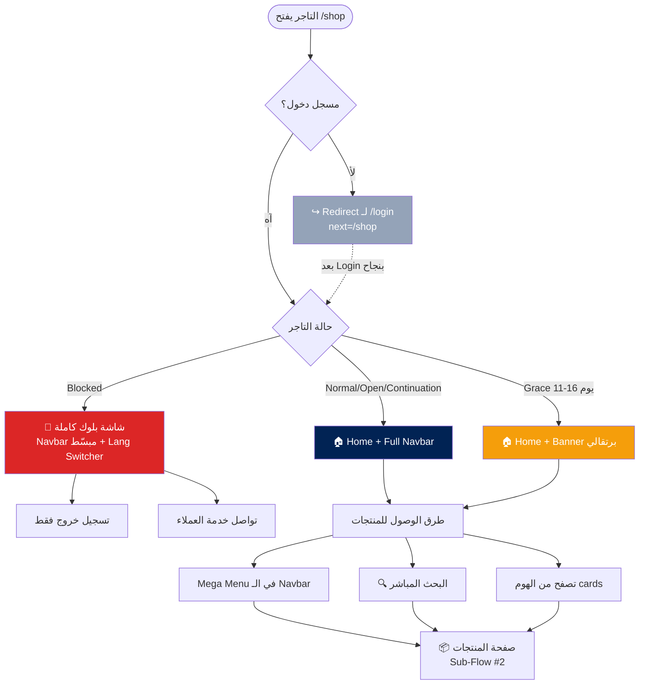

# 🏠 Sub-Flow #1: الصفحة الرئيسية (Home Page)

> **Project:** BlueBee-Eg B2B Wholesale Platform
> **Module:** `invoice_deadline` (Odoo 17)
> **Phase:** 1 — UX Planning
> **Status:** ✅ Approved by Sherif
> **Date:** May 2026
> **Scope:** الهوم المحمي للتاجر المعتمد فقط. الـ Landing Page للزوار في ملف `00_landing_and_application.md` (منفصل).
> **Scope note:** Protected home for approved merchants only. Public Landing page is in `00_landing_and_application.md` (separate).

---

## 📋 جدول المحتويات | Table of Contents

1. [الهدف من الصفحة](#الهدف)
2. [النطاق والربط مع 00](#النطاق)
3. [القرارات المعمارية](#القرارات-المعمارية)
4. [Information Architecture](#information-architecture)
5. [Sub-Flow Diagram](#sub-flow-diagram)
6. [Wireframes](#wireframes)
7. [Navbar Specification](#navbar-specification)
8. [Edge Cases](#edge-cases)
9. [Inputs لـ Claude Design](#inputs-لـ-claude-design)

---

<a name="الهدف"></a>
## 🎯 الهدف من الصفحة | Page Goal

الهوم مش مجرد صفحة عرض منتجات — هي **الواجهة الأولى للتاجر** بعد ما يعمل Login، ولازم تخدم 3 أهداف:

The home isn't just a product listing — it's **the merchant's first surface** after login, serving 3 simultaneous goals:

1. **تخليه يطلب بسرعة** — الهدف الأساسي للـ B2B
   Get him ordering fast — core B2B goal
2. **توضّح له حالته المالية** بدون إزعاج
   Surface his financial state without nagging
3. **تديله إحساس بمكتب احترافي** مش موقع عام
   Give him a professional office feel — not a generic shop

---

<a name="النطاق"></a>
## 🔗 النطاق والربط مع 00 | Scope & Link to 00

هذا الملف **بيغطي الهوم المحمي فقط** — الصفحة اللي يشوفها التاجر المعتمد بعد ما يعمل Login.

This file **covers only the protected home** — the page an approved merchant sees after login.

| السطح Surface | الملف File | الجمهور Audience |
|---|---|---|
| Landing Page (`/`) | `00_landing_and_application.md` | زوار غير مسجلين Non-registered visitors |
| Application Form | `00_landing_and_application.md` | تجار جدد بيطلبوا الانضمام New merchants applying |
| **Home (`/shop`)** | **هذا الملف this file** | **تجار معتمدين Approved merchants** |

### نقطة الربط Connection Point:
- زائر يدوس "طلب الانضمام" في Landing → يدخل Application form (في 00)
- بعد قبول الإدارة، التاجر يستلم credentials ويعمل Login → يدخل الـ Home (هذا الملف)
- Visitor clicks "Apply" on Landing → enters Application form (in 00)
- After admin approval, merchant gets credentials and logs in → enters Home (this file)

---

<a name="القرارات-المعمارية"></a>
## ✅ القرارات المعمارية | Architectural Decisions

| # | القرار Decision | الاختيار Choice | السبب Rationale |
|---|---|---|---|
| 1 | تنبيهات الفاتورة Invoice alerts | **Banner في Grace/Blocked + Badge على navbar للحالات الفعالة** | balance بين النظافة والحماية التجارية |
| 2 | Reorder section | **مفيش** — يخليها للبحث | تجنب الازدحام، البحث أقوى |
| 3 | Accessories | **Parent category** جوا الأطفال والمراهقين، قابل للتوسع | يستوعب أنواع جديدة مستقبلاً |
| 4 | التصنيف Taxonomy | **age-first** (5 أقسام رئيسية) | التاجر بيدوّر بالعمر مش بنوع المنتج |
| 5 | Navbar في حالة Blocked | **navbar مبسّط** — اسم + logout بس | رسالة حادة: مفيش تسوّق، فيه دفع |
| 6 | الوصول للأقسام Category access | **Mega Menu في الـ Navbar** + Home cards | التاجر اليومي مش لازم يرجع للهوم كل مرة |
| 7 | اللغة Bilingual support | **عربي افتراضي + Language Switcher في الـ Navbar** (AR/EN) | الجمهور 95% مصري + مرونة للتجار اللي يفضّلوا الإنجليزي |
| 8 | نبرة الكلام Tone of voice | **محايد جنسياً Gender-neutral** — "اطلب/تواصل" مش "اطلبي/تواصلي" | 2% رجالة جزء من الجمهور + neutral أفضل تجارياً للـ B2B |

---

<a name="information-architecture"></a>
## 🗺️ Information Architecture

```
🏠 Home
│
├── 👶 الرضع (Baby: 0–24m)
│   ├── ملابس خروج (Outerwear)
│   ├── ملابس بيت (Loungewear)
│   ├── Underwear
│   ├── أحذية (Footwear)
│   └── مستلزمات (Essentials)
│
├── 🧒 الأطفال (Kids: 2y–12y)
│   ├── ملابس خروج
│   ├── ملابس بيت
│   ├── Underwear
│   ├── أحذية
│   ├── شنط (Bags)
│   └── إكسسوارات (Accessories) ← parent category
│       ├── ملابس بحر (Swimwear)
│       ├── كوستيومز (Costumes)
│       └── إسدالات (Abayas)
│
├── 🧑 المراهقين (Teens: 12y–18y)
│   ├── ملابس خروج
│   ├── ملابس بيت
│   ├── Underwear
│   ├── أحذية
│   ├── شنط
│   └── إكسسوارات (نفس الـ subs)
│
├── 👩 السيدات (Women)
│   ├── ملابس حوامل (Maternity)
│   ├── ملابس بيت (Home wear)
│   └── كاجوال (Casual)
│
└── 👨 الرجال (Men)
    ├── ملابس بيت
    └── كاجوال
```

---

<a name="sub-flow-diagram"></a>
## 🔀 Sub-Flow Diagram



> **ملاحظة:** الـ Login flow نفسه (والـ Landing اللي قبله للزوار الجدد) موجود في `00_landing_and_application.md`.
> **Note:** The Login flow itself (and the Landing before it for new visitors) lives in `00_landing_and_application.md`.

---

<a name="wireframes"></a>
## 🖼️ Wireframes

### 1️⃣ Home — حالة Normal (Desktop)

```
┌──────────────────────────────────────────────────────────────────────┐
│ 🐝 BlueBee | المتجر ▾  العروض  فاتورتي | 🔍 [AR|EN] 👤أحمد 🛒(3)        │
└──────────────────────────────────────────────────────────────────────┘
│                                                                      │
│    ┌────────────────────────────────────────────┐                   │
│    │   Hero Carousel — تشكيلة جديدة             │                   │
│    │   [< ‖ ◉ ○ ○ > ]                          │                   │
│    └────────────────────────────────────────────┘                   │
│                                                                      │
│   تسوّق حسب الفئة | Shop by Age                                       │
│   ┌───────┐ ┌───────┐ ┌───────┐ ┌───────┐ ┌───────┐                  │
│   │  👶   │ │  🧒   │ │  🧑   │ │  👩   │ │  👨   │                  │
│   │ رضع   │ │ أطفال │ │ مراهق │ │ سيدات │ │ رجال  │                  │
│   │ 0-24m │ │ 2-12y │ │ 12-18 │ │       │ │       │                  │
│   └───────┘ └───────┘ └───────┘ └───────┘ └───────┘                  │
│                                                                      │
│   🏷️ العروض الحالية | Active Promotions                              │
│   ┌──────────────────┐ ┌──────────────────┐                          │
│   │  Promo Banner 1  │ │  Promo Banner 2  │                          │
│   └──────────────────┘ └──────────────────┘                          │
│                                                                      │
│   ┌────────────────────────────────────────────┐                    │
│   │ Footer: سياسة + تواصل + قنوات تليجرام      │                    │
│   └────────────────────────────────────────────┘                    │
└──────────────────────────────────────────────────────────────────────┘
```

> **ملاحظة عن `[AR|EN]`:** ده الـ Language Switcher — pill صغير قبل User dropdown. التفاصيل في قسم Navbar Specification.

---

### 2️⃣ Home — حالة Grace (يوم 11–16)

```
┌──────────────────────────────────────────────────────────────────────┐
│ ⚠️ فاتورة INV-042 محتاجة دفع — 3 أيام فاضلة            [ادفع الآن]   │ ← Banner برتقالي
│    Invoice INV-042 due — 3 days left                   [Pay now]     │   ثابت غير قابل للإخفاء
├──────────────────────────────────────────────────────────────────────┤
│ 🐝 BlueBee | المتجر ▾  العروض  فاتورتي(1) | 🔍 [AR|EN] 👤أحمد 🛒(3)    │
└──────────────────────────────────────────────────────────────────────┘
│                                                                      │
│              [نفس layout الـ Normal]                                  │
│              Standard layout (same as normal)                        │
│                                                                      │
└──────────────────────────────────────────────────────────────────────┘
```

**سلوك الـ Banner:**
- لون: برتقالي #f59e0b (تحذير، مش خطر)
- غير قابل للإخفاء (مش dismissible)
- زر "ادفع الآن" يودي مباشرة لصفحة الفاتورة
- يعد العداد كل ما يقل (3 أيام → يومين → يوم → اليوم الأخير)

**Banner behavior:**
- Color: orange #f59e0b (warning, not danger)
- Non-dismissible
- "Pay now" button → direct to invoice page
- Countdown updates as days decrease

---

### 3️⃣ Home — حالة Blocked (يوم 17+)

```
┌──────────────────────────────────────────────────────────────────────┐
│ 🐝 BlueBee                            [AR|EN]  👤أحمد  ⚙️              │ ← Navbar مبسّط + Lang Switcher
└──────────────────────────────────────────────────────────────────────┘   بدون 🛒 ولا روابط متجر
│                                                                      │
│                                                                      │
│                          🚫                                          │
│                                                                      │
│              حسابك متوقف مؤقتاً                                       │
│           Your account is suspended                                  │
│                                                                      │
│   فاتورة INV-042 غير مدفوعة منذ 17 يوم                                │
│   Invoice INV-042 unpaid for 17 days                                 │
│                                                                      │
│   ┌─────────────────────────────────────┐                           │
│   │  المطلوب لإعادة التفعيل:              │                           │
│   │  Required to reactivate:             │                           │
│   │                                      │                           │
│   │  • قيمة الفاتورة:    4,500 ج          │                           │
│   │  • غرامة التأخير:    1,000 ج          │                           │
│   │  ───────────────────────              │                           │
│   │  الإجمالي Total:     5,500 ج          │                           │
│   └─────────────────────────────────────┘                           │
│                                                                      │
│   ┌────────────────────────────────────┐                            │
│   │ 📞  تواصل مع خدمة العملاء           │                            │
│   │     Contact customer service       │                            │
│   └────────────────────────────────────┘                            │
│                                                                      │
│   📞 01080811579   💬 واتساب WhatsApp                                 │
│                                                                      │
└──────────────────────────────────────────────────────────────────────┘
```

**ملاحظات على شاشة البلوك:**
- مفيش روابط للمتجر أو الأقسام في الـ navbar
- مفيش بحث، مفيش سلة
- اسم التاجر يبقى موجود (dropdown فيه logout بس)
- الإعدادات متاحة (لو عايز يحدث contact info)
- **الـ Language Switcher يفضل موجود** — التاجر ممكن يحتاج يقرا رسالة البلوك بالإنجليزي
- الرسالة حادة وواضحة — تسوّق ممنوع، الدفع هو الحل

---

### 4️⃣ Mobile Navbar

```
┌────────────────────────┐
│ ☰  🐝 BlueBee  🔍 🛒(3) │
└────────────────────────┘
       │
       │ (tap ☰)
       ▼
┌────────────────────────┐
│ 👤 أهلاً أحمد           │
│ 📄 فاتورتي     [!]      │
│ ─────────────────       │
│ 🏠 الرئيسية              │
│ 👶 الرضع           ▸   │
│ 🧒 الأطفال         ▸   │
│ 🧑 المراهقين        ▸   │
│ 👩 السيدات         ▸   │
│ 👨 الرجال          ▸   │
│ 🏷️ العروض              │
│ ─────────────────       │
│ 🌐 اللغة | Language     │
│   ◉ عربية               │
│   ○ English             │
│ ─────────────────       │
│ ⚙️ الإعدادات             │
│ 🚪 تسجيل خروج           │
└────────────────────────┘
```

---

<a name="navbar-specification"></a>
## 🧭 Navbar Specification

### Desktop Navbar (Normal/Grace state)

```
┌──────────────────────────────────────────────────────────────────────┐
│ [Logo] | [Mega Menu ▾] [Promos] [My Invoice] | [🔍] [AR|EN] [User] [Cart] │
└──────────────────────────────────────────────────────────────────────┘
```

**Elements (RTL — من اليمين للشمال):**
1. **Logo** — يربط بالـ Home
2. **المتجر ▾** — يفتح Mega Menu (الأقسام الـ 5)
3. **العروض** — يودي لصفحة العروض النشطة
4. **فاتورتي** — يودي لصفحة الفواتير، يعرض badge لو في Grace/Blocked
5. **🔍 البحث** — يفتح search overlay
6. **🌐 Language Switcher [AR|EN]** — pill صغير لتبديل اللغة (تفاصيل تحت)
7. **👤 [اسم التاجر]** — dropdown:
   - بياناتي My profile
   - فواتيري My invoices
   - طلباتي My orders
   - تسجيل خروج Logout
8. **🛒 السلة (count)** — badge برقم المنتجات

### Language Switcher Specification

**الوصف:** Compact pill design فيه AR و EN. اختيار اللغة بيغيّر الصفحة كاملة **بدون reload** وبيتحفظ في **cookie للـ session**.

**Description:** Compact pill design with AR and EN. Language toggle switches the full page **without reload** and persists via **session cookie**.

**Design Spec:**
- **Active state:** Navy background (#012354) مع white text
- **Inactive state:** Transparent background مع Navy text (#012354)
- **Shape:** Compact pill, rounded
- **Separator:** خط رفيع فاصل بين AR و EN
- **Hover (Inactive):** Light navy tint للـ background
- **Click behavior:** فوري instant — مفيش loading state ظاهر

**شكل تقريبي Approximate visual:**
```
   ┌─────────────┐
   │ [AR] │ EN   │   ← AR نشط (Navy bg + white text)، EN غير نشط
   └─────────────┘
```

### Mega Menu (يفتح بـ hover أو click على "المتجر")

```
┌────────────────────────────────────────────────────────────┐
│ 👶 الرضع       🧒 الأطفال    🧑 المراهقين  👩 السيدات  👨 الرجال │
│ ─────         ─────         ─────        ─────       ─────│
│ ملابس خروج    ملابس خروج     ملابس خروج    حوامل       بيت  │
│ ملابس بيت     ملابس بيت      ملابس بيت     بيت         كاجوال│
│ Underwear    Underwear     Underwear     كاجوال              │
│ أحذية         أحذية          أحذية                            │
│ مستلزمات     شنط            شنط                              │
│              إكسسوارات ▸    إكسسوارات ▸                      │
│                  └─ ملابس بحر                                │
│                  └─ كوستيومز                                 │
│                  └─ إسدالات                                  │
└────────────────────────────────────────────────────────────┘
```

### Blocked State Navbar

```
┌─────────────────────────────────────────────────┐
│ [Logo]              [AR|EN] [User ▾] [Settings] │
└─────────────────────────────────────────────────┘
```

- مفيش Mega Menu
- مفيش Search
- مفيش Cart
- **Language Switcher موجود** (التاجر ممكن يحتاج يقرا رسالة البلوك بالإنجليزي)
- User dropdown يحتوي فقط على Logout

---

<a name="edge-cases"></a>
## 🚨 Edge Cases & Handling

| # | Case | السلوك Behavior |
|---|---|---|
| 1 | تاجر غير مسجل يفتح `/shop` | Redirect لـ `/login` مع `next=/shop`. الـ Landing نفسها في 00 |
| 2 | تاجر مسجل بيفتح `/` (Landing URL) | Auto-redirect لـ `/shop` (Home) |
| 3 | Hero banner فاضي (مفيش وصول جديد) | يتحول لـ static promo banner أو يختفي |
| 4 | تاجر عنده فاتورة Open وزوّد منتجات في السلة | يضاف على نفس SO (Unified Invoice — راجع Sub-Flow #3 Cart) |
| 5 | تاجر في Continuation state ويفتح الهوم | يبان نفس الـ Normal layout (مفيش banner) — الفاتورة في صفحتها |
| 6 | Internet ضعيف | Categories grid أولوية في الـ load، Hero/Promotions lazy load |
| 7 | تاجر يضغط على قسم وهو Blocked | يفترض ميقدرش لأن الـ navbar مبسّط، لكن لو فتح URL مباشر → redirect لشاشة البلوك |
| 8 | في Grace state، التاجر يدفع الفاتورة | Banner يختفي فوراً، يرجع Normal state |
| 9 | التاجر بيغير اللغة لـ EN وهو في صفحة منتج | الصفحة تتحول لإنجليزي **بدون ما يفقد مكانه** (نفس الـ product page) |
| 10 | التاجر في Blocked state وعايز يقرا رسالة البلوك بالإنجليزي | الـ Language Switcher متاح في الـ navbar المبسّط |
| 11 | اختيار اللغة بين الصفحات | بيتحفظ في **cookie** ومش بيرجع للعربي لما يـ navigate بين الصفحات |
| 12 | اللغة تتغير → الـ direction يتغير | RTL لما اللغة عربية، LTR لما اللغة إنجليزية — تلقائي |
| 13 | الخط يتبدل مع اللغة | Arabic: FF Malmoom — English: Bulgia. font swap تلقائي |

---

<a name="inputs-لـ-claude-design"></a>
## 🎨 Inputs لـ Claude Design

لما ييجي وقت الـ handoff لـ Claude Design (بعد ما الـ 7 sub-flows يخلصوا — من 00 لـ 06):

### الـ Bundle المطلوب رفعه:
1. ✅ هذا الملف `01_home.md`
2. ⏳ `00_landing_and_application.md` (الـ next sub-flow)
3. ⏳ باقي ملفات flows (`02_*.md` → `06_*.md`)
4. ✅ `BUSINESS_LOGIC.md`
5. ✅ Brand Guideline PDF (Bulgia + FF Malmoom + Navy/Bright blue)

### الـ Prompts المقترحة لـ Claude Design:

**Prompt 1 — Design System:**
```
ابني design system لـ BlueBee:
- اللي مرفق Brand Guideline + 7 sub-flows
- ابدأ بـ tokens (colors, typography, spacing, shadows)
- بعدها components (button, card, input, banner, badge, navbar,
  mega menu, language switcher)
- مخرج: design-system.tsx + Storybook-style preview
```

**Prompt 2 — Home Page Mockups:**
```
بناءً على design system وملف 01_home.md:
- ابني 3 mockups (Home Normal, Home Grace, Home Blocked)
- React + Tailwind، responsive (desktop + mobile)
- استخدم الـ Information Architecture الموجودة في الملف
- اربط بين الـ mockups (clickable prototype)
- اختبر الـ Language Switcher (AR ↔ EN) في الـ prototype
```

### ملاحظات حساسة لـ Claude Design:
- **اللغة الأساسية:** عربي (RTL) — افتراضي. الـ Switcher يبدّل لإنجليزي (LTR) مباشرة
- **Language Switcher إجباري في الـ Navbar** — متناسق مع تصميم BlueBee (Navy pill)، **مش الافتراضي بتاع Odoo**
- **الـ Fonts:** Arabic بـ **FF Malmoom** — English بـ **Bulgia**. font swap تلقائي حسب اللغة
- **الجمهور:** تجار من الجنسين (98% سيدات + 2% رجالة)، لكن النبرة **محايدة جنسياً** — مش موجهة للسيدات فقط
- **كل النصوص بـ "اطلب/تواصل"** مش "اطلبي/تواصلي" — gender-neutral
- **الفئة العمرية:** بالغين (مش أطفال) — الـ pattern الطفولي يبقى accent مش طاغي
- **الـ navbar:** mega menu حساس — لازم يكون واضح ومايتلخبطش على الموبايل

### Design Spec للـ Language Switcher:
| Property | Value |
|---|---|
| Shape | Compact pill, rounded |
| Active state | Navy background (#012354) + white text |
| Inactive state | Transparent background + Navy text (#012354) |
| Separator | خط رفيع فاصل بين AR و EN |
| Hover (Inactive) | Light navy tint |
| Transition | فوري instant — مفيش loading state |
| Persistence | Cookie للـ session |

---

## 📊 Acceptance Criteria

- [ ] الـ Home Normal بيوصّل تاجر لقسم أي منتج في أقل من 3 كليكات
- [ ] Banner الـ Grace ظاهر وغير قابل للإخفاء
- [ ] شاشة الـ Blocked واضحة ومفيهاش روابط متجر
- [ ] الـ Mega Menu شغال على Desktop + Mobile
- [ ] Badge الفاتورة بيظهر في Grace + Blocked فقط
- [ ] الـ Hero بيلودي في أقل من 2 ثانية على 3G
- [ ] تاجر غير مسجل بيتحول لـ login مع return URL
- [ ] **Language Switcher شغال في الـ Navbar في كل الحالات (Normal, Grace, Blocked)**
- [ ] **اختيار اللغة بيتحفظ في cookie وثابت بين الصفحات**
- [ ] **الـ RTL/LTR direction بيتغير تلقائياً مع اللغة**
- [ ] **الـ Fonts بتتبدل: Arabic بـ FF Malmoom و English بـ Bulgia**
- [ ] **كل اللغة محايدة جنسياً (مفيش "اطلبي/تواصلي")**

---

## 🔗 الـ Sub-Flows المرتبطة

- **Sub-Flow #0:** Landing + Application — الصفحة العامة وflow طلب الانضمام
- **Sub-Flow #2:** البحث والفلترة (Search & Filtering) — كل path في الـ Mega Menu يودي هنا
- **Sub-Flow #3:** الكارت والطلب (Cart & Order) — أيقونة السلة
- **Sub-Flow #4:** الدفع والتأكيد (Payment) — زر "ادفع الآن" في Banner الـ Grace
- **Sub-Flow #5:** بعد الطلب (Post-order)
- **Sub-Flow #6:** Onboarding (للتجار الجدد بعد قبول طلبهم)

---

## 📝 Change Log

| Date | Change | By |
|---|---|---|
| May 2026 | إنشاء أولي بعد جلسة قرارات | Claude Chat (Opus 4.7) |
| May 2026 | إضافة Mega Menu، تعديل Blocked navbar، تصحيح placeholder الاسم | Based on Sherif's feedback |
| May 2026 | إخراج Landing لملف منفصل (00_landing_and_application.md) | Based on Sherif's architectural feedback |
| May 2026 | **تحييد اللغة جنسياً + إضافة Language Switcher في الـ Navbar** | Based on Sherif's feedback (Sub-Flow #0 alignment) |

---

**✅ Sherif Approved — Ready for Claude Design handoff (بعد ما الـ 7 sub-flows يخلصوا)**
