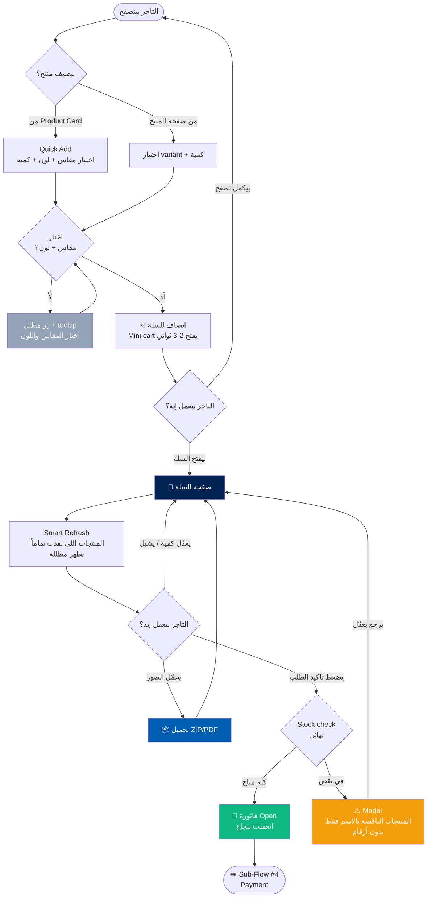

# 🛒 Sub-Flow #3: السلة والطلب (Cart & Order)

> **Project:** BlueBee-Eg B2B Wholesale Platform
> **Module:** `invoice_deadline` (Odoo 17)
> **Phase:** 1 — UX Planning
> **Status:** 🟡 Draft — في انتظار مراجعة شريف
> **Date:** May 2026
> **Scope:** يغطي رحلة التاجر من إضافة المنتج للسلة، مروراً بمراجعة السلة (Mini cart + Full page)، وصولاً للـ Confirm اللي بيحوّل السلة لفاتورة (Open invoice). بيشمل الـ stock validation الذكي، ميزة تحميل صور المنتجات، وحالات الـ Blocked.
> **Scope note:** Covers the merchant journey from adding a product to cart, through cart review (Mini cart + Full page), to Confirm which converts the cart into an invoice (Open state). Includes smart stock validation, product image download feature, and Blocked states.

---

## 📋 جدول المحتويات | Table of Contents

1. [الهدف من الصفحة](#الهدف)
2. [النطاق والربط مع باقي الـ Flows](#النطاق)
3. [القرارات المعمارية](#القرارات-المعمارية)
4. [الفرق الجوهري: السلة vs الفاتورة](#السلة-vs-الفاتورة)
5. [URL Structure](#url-structure)
6. [Sub-Flow Diagram](#sub-flow-diagram)
7. [Wireframes](#wireframes)
8. [Stock Validation Logic](#stock-validation)
9. [ميزة تحميل صور المنتجات](#image-download)
10. [Security: Defense in Depth](#security)
11. [Empty States & Edge Cases](#edge-cases)
12. [Performance Targets](#performance)
13. [Inputs لـ Claude Design](#inputs-لـ-claude-design)
14. [Implementation Notes for Claude Code](#implementation)

---

<a name="الهدف"></a>
## 🎯 الهدف من الصفحة | Page Goals

السلة هي **نقطة التحول التجاري** — اللحظة اللي بيتحول فيها الاستكشاف لالتزام. الهدف:

The cart is **the commercial turning point** — the moment exploration becomes commitment. Goals:

1. **يبني طلبه على مدار أيام بثقة** — السلة persistent، مش بتضيع، التاجر يرجع يلاقي شغله
   Build the order over days with confidence — persistent cart that never disappears

2. **يراجع قبل الالتزام** — Mini cart للنظرة السريعة + Full page للمراجعة النهائية
   Review before commitment — Mini cart for quick glance + Full page for final review

3. **يفهم إن الـ Confirm قرار نهائي** — بعد الـ Confirm، الفاتورة ملزمة (مفيش إلغاء ذاتي)
   Understand Confirm is final — after Confirm, the invoice is binding (no self-cancellation)

4. **يحمّل صور منتجاته للتسويق** — ميزة تنافسية للتاجر الأونلاين (فيسبوك/واتساب)
   Download product images for marketing — competitive edge for online merchants

5. **مايعرفش مخزوننا الفعلي** — حماية من الـ stock enumeration بدون التضحية بالـ UX
   Doesn't learn our actual stock — protection from enumeration without sacrificing UX

---

<a name="النطاق"></a>
## 🔗 النطاق والربط مع باقي الـ Flows | Scope & Connections

هذا الـ Sub-Flow بيغطي **رحلة السلة بالكامل قبل الفاتورة:**

This Sub-Flow covers **the complete cart journey before invoicing:**

| المرحلة Stage | الوصف Description |
|---|---|
| Add to Cart | من Product Card (Quick Add) أو من صفحة المنتج |
| Mini Cart | Dropdown سريع من الـ Navbar (preview) |
| Full Cart Page | المراجعة الكاملة قبل الـ Confirm — `/shop/cart` |
| Confirm | تحويل السلة لفاتورة Open (هنا بينتهي هذا الـ Sub-Flow) |

### الربط مع Sub-Flows التانية | Connections to Other Sub-Flows

- **Sub-Flow #2 (Search & Browse):** كل "أضف للسلة" بيوصّل هنا
- **Sub-Flow #4 (Payment):** بعد الـ Confirm، الفاتورة Open → التاجر يقدر يطلب الدفع (شحن/استكمال)
- **Sub-Flow #5 (Post-order):** عرض الفواتير وحالاتها

> **حد فاصل مهم:** الـ Confirm هو **نهاية هذا الـ Sub-Flow**. كل ما يحصل بعد كده (الدفع، الشحن، الاستكمال) موضوع Sub-Flow #4 و #5.
>
> **Important boundary:** Confirm is the **end of this Sub-Flow**. Everything after (payment, shipping, continuation) belongs to Sub-Flow #4 and #5.

---

<a name="القرارات-المعمارية"></a>
## ✅ القرارات المعمارية | Architectural Decisions

| # | القرار Decision | الاختيار Choice | السبب Rationale |
|---|---|---|---|
| 1 | عمر السلة Cart lifetime | **Persistent بدون stock reservation** | B2B model، التاجر بيستكشف على مدار أيام، فقدان السلة = breakdown في الثقة |
| 2 | Smart Refresh | **عند فتح السلة، المنتجات اللي نفدت تماماً (out of stock) تظهر مظللة** فقط — مش الكميات الجزئية | حماية من الـ stock enumeration مع UX واضح |
| 3 | التعديل بعد الـ Confirm | **مفيش** — الفاتورة immutable. لا إلغاء ولا تبديل ولا تخفيض كمية. الإضافة مسموحة. أي تعديل = خدمة العملاء | بساطة الكود + حماية الشركة + وضوح القاعدة للتاجر |
| 4 | Stock check | **فقط لحظة الـ Confirm** (مفيش check في الـ frontend ولا عند فتح السلة للكميات الجزئية) | منع الـ enumeration — التاجر مايقدرش يـ probe المخزون |
| 5 | رسالة نقص المخزون | **"الكمية المتوفرة أقل" بدون عرض أرقام** — التاجر يعدّل بنفسه | لو حاول enumerate، هيـ commit على فاتورة ملزمة |
| 6 | شكل السلة Cart UI | **Mini cart (Navbar dropdown) + Full page** | الـ dropdown للاطمئنان السريع، الصفحة الكاملة قبل الـ commit |
| 7 | عرض الـ Variants | **كل variant في line منفصل** | الـ stock والـ SKU مختلفين، Odoo default |
| 8 | الحد الأدنى 6 قطع | **مش في السلة** — يظهر في الفاتورة وقت الشحن (Sub-Flow #4/#5) | الرسوم تتطبق عند الشحن فقط، مش في السلة |
| 9 | عرض الـ Total | **عدد القطع + الإجمالي فقط** (مفيش شحن/ضرايب) | الشحن بيتحدد بعد الـ Confirm، السعر شامل |
| 10 | حالة الـ Blocked | **Full-page block للموقع كله + زر تواصل مع الشركة** | البلوك عقوبة، مفيش access للموقع. السلة محفوظة بس مش متاحة |
| 11 | تحميل صور المنتجات | **في 3 أماكن: صفحة المنتج + السلة + الفاتورة. ZIP/PDF. بدون watermark. Async** | ميزة تنافسية للتاجر الأونلاين (marketing) |
| 12 | الـ Add to Cart feedback | **Mini cart يفتح 2-3 ثواني ثم يقفل** + التاجر يفضل في صفحته | B2B بيضيف منتجات كتير، يفضل في نفس الصفحة |
| 13 | اختيار الـ Variant | **Add to Cart disabled لحد ما يختار مقاس + لون** (+ backend validation) | UX واضح + أمان حقيقي في الـ backend |
| 14 | الكمية الافتراضية | **1** — التاجر يزود بالـ +/- أو يكتب الرقم | بداية معقولة |
| 15 | الحد الأقصى للكمية | **مفيش حد من الـ UI** — التاجر يكتب أي رقم، يكتشف النقص عند الـ Confirm فقط | منع الـ enumeration |

---

<a name="السلة-vs-الفاتورة"></a>
## ⚖️ الفرق الجوهري: السلة vs الفاتورة | Cart vs Invoice

ده أهم مفهوم في الـ Sub-Flow ده. **السلة مش الفاتورة.**

This is the most important concept. **The cart is not the invoice.**

| | 🛒 السلة (Cart) | 📄 الفاتورة (Invoice — Open) |
|---|---|---|
| الملكية Ownership | ملك التاجر بالكامل | entity تجاري ملزم |
| التعديل Editing | حر — يضيف، يشيل، يبدّل، يغيّر كمية | immutable — الإضافة بس مسموحة |
| الـ Stock | مش محجوز | اتحجز فعلياً |
| الـ State | مفيش (مجرد سلة) | Open (عداد 10 أيام بدأ) |
| الإلغاء Cancellation | حر تماماً | خدمة العملاء فقط (قرار إداري) |

### اللحظة الحاسمة: الـ Confirm

```
🛒 السلة (حر)  ──[الـ Confirm]──►  📄 فاتورة Open (ملزمة)
                       │
                       ├─ الـ Stock check النهائي
                       ├─ الـ Stock يتحجز
                       └─ عداد 10 أيام يبدأ
```

> **القاعدة الذهبية:** قبل الـ Confirm = استكشاف حر. بعد الـ Confirm = التزام. مفيش رجوع إلا عبر خدمة العملاء.
>
> **Golden rule:** Before Confirm = free exploration. After Confirm = commitment. No going back except via customer service.

---

<a name="url-structure"></a>
## 🌐 URL Structure

```
/shop/cart                    → صفحة السلة الكاملة Full cart page
/shop/cart (Mini)             → dropdown من الـ Navbar (مش URL منفصل)
```

> الـ Mini cart مش URL منفصل — هو dropdown component في الـ Navbar بيفتح فوق أي صفحة.
>
> الـ Confirm action بيـ POST لـ controller endpoint (مثلاً `/shop/cart/confirm`) بيعمل الـ stock check + تحويل لفاتورة. مفيش صفحة منفصلة للـ Confirm نفسه — النتيجة يا redirect لصفحة الفاتورة يا modal بالمنتجات الناقصة.

---

<a name="sub-flow-diagram"></a>
## 🔀 Sub-Flow Diagram



---

<a name="wireframes"></a>
## 🖼️ Wireframes

### 1️⃣ Mini Cart — Dropdown من الـ Navbar (Arabic RTL)

```
┌────────────────────────────────────────────────────────────────────────┐
│ 🐝 BlueBee | المتجر ▾  العروض  فاتورتي | 🔍 [AR|EN] 👤أحمد 🛒(3)        │
└──────────────────────────────────────────────────────────┬─────────────┘
                                                            ▼
                                          ┌──────────────────────────────┐
                                          │  السلة (3 منتجات)             │
                                          │  ────────────────────────    │
                                          │  ┌────┐ طقم بيتي قطن          │
                                          │  │IMG │ مقاس M • أزرق         │
                                          │  └────┘ 2 × 85 ج    [🗑]      │
                                          │  ────────────────────────    │
                                          │  ┌────┐ فستان سواريه          │
                                          │  │IMG │ مقاس 4س • وردي        │
                                          │  └────┘ 1 × 180 ج   [🗑]      │
                                          │  ────────────────────────    │
                                          │  الإجمالي: 350 ج              │
                                          │                              │
                                          │  ┌────────────────────────┐  │
                                          │  │   عرض السلة الكاملة     │  │
                                          │  └────────────────────────┘  │
                                          └──────────────────────────────┘
```

**سلوك الـ Mini Cart:**
- بيفتح تلقائياً 2-3 ثواني بعد "أضف للسلة"، بعدها بيقفل
- بيفتح يدوياً لما التاجر يدوس على أيقونة 🛒
- بيعرض آخر 3-4 منتجات + الإجمالي
- زر "عرض السلة الكاملة" بيودّي لـ `/shop/cart`
- مفيش Confirm من الـ Mini cart — لازم الصفحة الكاملة

---

### 2️⃣ Full Cart Page — Desktop (Arabic RTL)

```
┌────────────────────────────────────────────────────────────────────────┐
│ 🐝 BlueBee | المتجر ▾  العروض  فاتورتي | 🔍 [AR|EN] 👤أحمد 🛒(3)        │
├────────────────────────────────────────────────────────────────────────┤
│ الرئيسية > السلة                                                        │
│                                                                        │
│  ┌──── منتجات السلة (3/4) ─────────────┐  ┌── الملخص (1/4) ──────┐   │
│  │                                       │  │                       │   │
│  │ ┌────┐ طقم بيتي قطن قصير             │  │  عدد القطع:  3        │   │
│  │ │IMG │ مقاس M • أزرق                 │  │  الإجمالي:   350 ج    │   │
│  │ └────┘ [- 2 +]    85 ج × 2 = 170 ج  │  │                       │   │
│  │              [🗑 إزالة]              │  │  ┌─────────────────┐  │   │
│  │ ───────────────────────────────────  │  │  │  تأكيد الطلب     │  │   │
│  │ ┌────┐ فستان سواريه                  │  │  └─────────────────┘  │   │
│  │ │IMG │ مقاس 4س • وردي                │  │                       │   │
│  │ └────┘ [- 1 +]    180 ج × 1 = 180 ج │  │  ⚠️ بعد التأكيد، لا    │   │
│  │              [🗑 إزالة]              │  │  يمكن الإلغاء إلا     │   │
│  │ ───────────────────────────────────  │  │  عبر خدمة العملاء     │   │
│  │ ┌────┐ قميص كاجوال  [نفد المخزون]   │  │                       │   │
│  │ │▓▓▓▓│ مقاس L • أبيض  ← مظلل         │  └───────────────────────┘   │
│  │ └────┘ [🗑 إزالة]                   │                              │
│  │                                       │   ┌─────────────────────┐   │
│  │                                       │   │ 📦 حمّل صور السلة    │   │
│  │                                       │   └─────────────────────┘   │
│  └───────────────────────────────────────┘                            │
└────────────────────────────────────────────────────────────────────────┘
```

**ملاحظات على الـ Full Cart:**
- المنتج اللي نفد تماماً (out of stock) بيظهر **مظلل** مع badge "نفد المخزون" + زر إزالة فقط (Smart Refresh)
- كل variant في line منفصل
- الـ quantity stepper (- N +) لكل line
- الـ Total = عدد القطع + الإجمالي **فقط** (مفيش شحن/ضرايب)
- تحذير الـ immutability واضح جنب زر التأكيد
- زر "حمّل صور السلة" تحت الملخص

> **RTL Note:** قائمة المنتجات على اليمين (inline-start)، الملخص على الشمال. بيتقلب تلقائياً في إنجليزي (CSS Logical Properties).

---

### 3️⃣ Full Cart Page — Mobile (Arabic RTL)

```
┌────────────────────────┐
│ ☰  🐝 BlueBee  🔍 🛒(3) │
├────────────────────────┤
│ السلة                  │
├────────────────────────┤
│ ┌────┐ طقم بيتي قطن    │
│ │IMG │ مقاس M • أزرق   │
│ └────┘ [- 2 +]         │
│        170 ج    [🗑]   │
│ ──────────────────────  │
│ ┌────┐ فستان سواريه    │
│ │IMG │ مقاس 4س • وردي  │
│ └────┘ [- 1 +]         │
│        180 ج    [🗑]   │
│ ──────────────────────  │
│ ┌────┐ قميص [نفد]      │
│ │▓▓▓▓│ مقاس L • أبيض   │
│ └────┘ [🗑 إزالة]      │
├────────────────────────┤
│ 📦 حمّل صور السلة       │
├════════════════════════┤  ← Sticky bottom bar
│ عدد القطع: 3           │
│ الإجمالي: 350 ج        │
│ ┌────────────────────┐ │
│ │   تأكيد الطلب       │ │
│ └────────────────────┘ │
│ ⚠️ لا إلغاء بعد التأكيد │
└────────────────────────┘
```

**ملاحظات Mobile:**
- الملخص + زر التأكيد في **sticky bottom bar** دايماً ظاهر
- نفس الـ Smart Refresh (المنتج النافد مظلل)

---

### 4️⃣ Empty Cart State

```
┌────────────────────────────────────────────────────────────────────────┐
│ 🐝 BlueBee | ...                                                       │
├────────────────────────────────────────────────────────────────────────┤
│ السلة                                                                  │
│                                                                        │
│                          🛒                                            │
│                                                                        │
│                  سلتك فاضية                                            │
│              Your cart is empty                                        │
│                                                                        │
│         ابدأ تستكشف المنتجات لإضافتها لسلتك                            │
│                                                                        │
│   ┌────────────────────┐    ┌────────────────────┐                    │
│   │  تصفح المنتجات      │    │  اطّلع على الجديد   │                    │
│   └────────────────────┘    └────────────────────┘                    │
└────────────────────────────────────────────────────────────────────────┘
```

**سلوك Empty State:**
- رسالة واضحة بدون شعور سلبي
- زر "تصفح المنتجات" → `/shop`
- زر "اطّلع على الجديد" → `/shop?sort=newest`

---

### 5️⃣ Confirm — Shortage Modal (نقص في المخزون)

```
        ┌──────────────────────────────────────────────┐
        │                                           ✕  │
        │                  ⚠️                            │
        │                                                │
        │     لا يمكن تأكيد طلبك بالكميات الحالية         │
        │                                                │
        │     المنتجات التالية متاحة بكميات أقل من        │
        │     اللي طلبته:                                 │
        │                                                │
        │     • طقم بيتي قطن (مقاس M، أزرق)              │
        │     • فستان سواريه (مقاس 4س، وردي)            │
        │                                                │
        │     يلزم تعديل الكميات قبل التأكيد.             │
        │     تذكّر: بعد التأكيد، الفاتورة ملزمة          │
        │     ولا يمكن إلغاؤها.                           │
        │                                                │
        │           ┌──────────────────────────┐         │
        │           │  ارجع للسلة أعدّل الكميات │         │
        │           └──────────────────────────┘         │
        └──────────────────────────────────────────────┘
```

**سلوك Shortage Modal (مهم جداً):**
- بيعرض **أسماء المنتجات الناقصة فقط** — **بدون أي أرقام أو كميات**
- **مفيش زر "كمّل بالمتاح"** — لأنه هيكشف الرقم ضمنياً
- **مفيش زر "شيل الناقص"** — نفس السبب
- زر واحد بس: "ارجع للسلة عدّل بنفسك"
- تحذير الـ immutability موجود — لو حاول enumeration، هيعرف إنه هيـ commit على فاتورة ملزمة

> **السبب الأمني:** لو عرضنا "متاح 15 بس"، التاجر يقدر يعمل binary search على المخزون. إخفاء الرقم بيمنع ده تماماً. والـ immutability بتخلّي أي محاولة enumeration مكلفة (لو وصل للرقم الصح، هيتحط في فاتورة ملزمة).

---

<a name="stock-validation"></a>
## 📦 Stock Validation Logic

### المبدأ الأساسي: الـ Stock مايظهرش أبداً في الـ UI

The core principle: **stock is never shown in the UI.**

| اللحظة Moment | السلوك Behavior |
|---|---|
| في صفحة المنتج | "متاح" / "نفد المخزون" — بدون أرقام |
| عند الإضافة للسلة | بيتضاف بأي كمية، مفيش validation للـ stock في الـ frontend |
| عند فتح السلة | Smart Refresh — المنتجات اللي نفدت **تماماً** تظهر مظللة فقط (مش الكميات الجزئية) |
| عند الـ Confirm | الـ check النهائي — لو في نقص، أسماء المنتجات فقط بدون أرقام |

### ليه مفيش عرض للكميات الجزئية؟

**لمنع الـ Stock Enumeration Attack:**

```
لو النظام بيقول "متاح 15 بس":
التاجر يحاول 100 → "متاح 15"  ← عرف المخزون فوراً!

لو النظام بيقول "الكمية المتوفرة أقل":
التاجر يحاول 100 → "أقل"
يحاول 50 → "أقل"
يحاول 25 → "نجح" ← دلوقتي عنده فاتورة ملزمة بـ 25 قطعة!
```

**الـ enumeration بقت مكلفة** — أي محاولة ناجحة بتتحول لالتزام مالي حقيقي (الفاتورة immutable).

### Smart Refresh عند فتح السلة

```
عند فتح /shop/cart:
  لكل line في السلة:
    لو الـ variant نفد تماماً (qty_available == 0):
      → اعرضه مظلل + badge "نفد المخزون" + زر إزالة فقط
    لو الـ variant متاح (حتى لو أقل من الكمية المطلوبة):
      → اعرضه طبيعي (مفيش تلميح للكمية)
    لو المنتج اتحذف من الكتالوج:
      → اعرضه بـ "غير متاح" + زر إزالة
```

> **ملاحظة:** الـ Smart Refresh بيكشف فقط الحالة الثنائية (نفد / متاح)، مش الكمية. ده بيحافظ على الـ UX (التاجر يعرف إيه اللي نفد) بدون information leak.

---

<a name="image-download"></a>
## 📦 ميزة تحميل صور المنتجات | Product Image Download

ميزة تنافسية مهمة للتاجر الأونلاين — بيعرض المنتجات على فيسبوك/واتساب لعملائه.

A key competitive feature for online merchants — they market products on Facebook/WhatsApp.

### الأماكن الـ 3 للزر | The 3 Button Locations

| المكان Location | النطاق Scope |
|---|---|
| صفحة المنتج Product page | صور المنتج الواحد |
| صفحة السلة Cart page | صور كل منتجات السلة |
| صفحة الفاتورة Invoice page | صور كل منتجات الفاتورة (بعد الـ Confirm) |

### خيارات التحميل | Download Options

الزر بيفتح modal صغير فيه:

```
        ┌──────────────────────────────────────────┐
        │  حمّل صور المنتجات                     ✕  │
        │  ──────────────────────────────────       │
        │                                            │
        │  الصور:                                    │
        │  ◉ الصورة الرئيسية فقط (Main image)        │
        │  ○ كل الصور (All images)                   │
        │                                            │
        │  الصيغة:                                   │
        │  ◉ ملف مضغوط (ZIP)                         │
        │  ○ ملف PDF (catalog)                       │
        │                                            │
        │         ┌──────────────────────┐           │
        │         │       حمّل            │           │
        │         └──────────────────────┘           │
        └──────────────────────────────────────────┘
```

### المواصفات | Specifications

| المواصفة Spec | القيمة Value |
|---|---|
| الصيغ Formats | ZIP أو PDF (التاجر يختار) |
| نطاق الصور Image scope | Main image only (default) أو All images |
| الـ Watermark | **مفيش** — صور نضيفة (التاجر هو الـ face للعميل النهائي) |
| اسم الملف File name | `BlueBee-Cart-YYYY-MM-DD.zip` |
| أسماء الصور | `001_اسم-المنتج_مقاس-X.jpg` (ترقيم + اسم + variant) |
| الـ Generation | **Async** مع loading state ("بنحضّر صورك...") |
| الإتاحة Availability | كل التجار الـ active (مفيش restriction) |

### ليه بدون watermark؟

التاجر بيـ resell المنتجات، وهو الـ face للعميل النهائي. لو حطينا branding هنخلق tension. الـ trust بين BlueBee والتاجر هو الحماية الحقيقية.

### ملاحظة الأداء

لو السلة فيها 20 منتج × 4 صور = 80 صورة. الـ ZIP/PDF ممكن ياخد 5-10 ثواني. لازم:
- Loading state واضح
- الـ generation في الـ background (async task في Odoo)
- لما يخلص، الـ download يبدأ تلقائياً

---

<a name="security"></a>
## 🔒 Security: Defense in Depth

كل الـ validations لازم تكون في **طبقتين**:

All validations MUST be enforced in **two layers**:

### Layer 1 — Frontend (UX)
- حالات الأزرار (disabled/enabled)
- Tooltips ورسائل inline
- **الهدف:** تجربة مستخدم، منع الأخطاء الواضحة
- **نقطة الضعف:** قابل للتلاعب من DevTools

### Layer 2 — Backend (Security)
- Validation في الـ Odoo controller
- **الهدف:** الأمان الحقيقي
- **مايتـ bypass ش من العميل**

### Validations المطلوبة في الطبقتين

| Validation | Frontend | Backend |
|---|---|---|
| اختيار الـ variant (مقاس + لون) | زر disabled + tooltip | الـ controller يرفض لو مفيش variant |
| الكمية ≤ المتاح | لا (متعمد، منع enumeration) | الـ check عند الـ Confirm فقط |
| التاجر active (مش blocked/pending) | redirect لشاشة البلوك | الـ controller يرفض الـ Confirm |
| المنتج published & saleable | مايظهرش في الكتالوج | الـ controller يتحقق |

> **القاعدة:** Never trust the client. أي زر disabled في الـ frontend ممكن يتحول لـ enabled من الـ DevTools — فالـ backend هو خط الدفاع الحقيقي.
>
> **Rule:** Never trust the client. Any disabled button can be flipped via DevTools — the backend is the real line of defense.

---

<a name="edge-cases"></a>
## 🚨 Edge Cases & Handling

| # | Case | السلوك Behavior |
|---|---|---|
| 1 | التاجر ضاف منتج وقفل الموقع لأسابيع | السلة محفوظة (persistent)، يرجع يلاقيها زي ما ساب |
| 2 | منتج في السلة نزل سعره | Smart refresh بيحدّث السعر للسعر الحالي عند فتح السلة |
| 3 | منتج في السلة نفد تماماً | بيظهر مظلل + "نفد المخزون" + زر إزالة فقط |
| 4 | منتج في السلة اتحذف من الكتالوج | بيظهر "غير متاح" + زر إزالة |
| 5 | التاجر حاول يضيف بدون اختيار مقاس/لون | الزر disabled + tooltip + الـ backend يرفض لو حاول bypass |
| 6 | التاجر كتب كمية ضخمة (مثلاً مليون) | بيتضاف عادي للسلة، يكتشف النقص عند الـ Confirm فقط |
| 7 | عند الـ Confirm، منتج واحد ناقص | Modal بأسماء المنتجات الناقصة (بدون أرقام) + زر "ارجع عدّل" |
| 8 | عند الـ Confirm، كل المنتجات نفدت | Modal: "كل المنتجات نفدت" + زر "بلّغني" + زر "تصفح" |
| 9 | التاجر بيحاول enumeration (يعدّل ويـ confirm متكرر) | كل محاولة ناجحة = فاتورة ملزمة. الـ immutability هي الـ deterrent |
| 10 | التاجر في حالة Blocked وفتح `/shop/cart` | Full-page block للموقع كله + زر تواصل (السلة محفوظة بس مش متاحة) |
| 11 | التاجر بدّل اللغة AR↔EN وهو في السلة | المحتوى يتترجم، السلة تفضل بكل اللي فيها، الـ layout يتقلب |
| 12 | التاجر عنده فاتورة Open بالفعل وعمل Confirm جديد | الإضافات بتروح لنفس الفاتورة (الفاتورة الموحدة — Sub-Flow #4) |
| 13 | التاجر حمّل الصور والسلة فيها 20 منتج | Async generation + loading state، الـ download يبدأ لما يخلص |
| 14 | التاجر شال كل المنتجات | Empty cart state + زر "تصفح المنتجات" |

---

<a name="performance"></a>
## ⚡ Performance Targets

| Metric | الهدف |
|---|---|
| فتح صفحة السلة Cart page load | < 1.5s on 4G |
| Smart Refresh response | < 800ms |
| Add to Cart response | < 500ms |
| الـ Confirm + stock check | < 1.5s |
| توليد صور ZIP/PDF (10 منتجات) | < 8s (async، loading state) |
| Mini cart open animation | < 200ms |

---

<a name="inputs-لـ-claude-design"></a>
## 🎨 Inputs لـ Claude Design

### الـ Bundle المطلوب

1. ✅ هذا الملف `03_cart.md`
2. ✅ `01_home.md` (Navbar reference — مكان الـ Mini cart)
3. ✅ `02_search_and_browse.md` (Product Card — مصدر الـ Add to Cart)
4. ✅ `BUSINESS_LOGIC.md` (حالات Blocked، الفاتورة الموحدة)
5. ✅ Brand Guideline PDF

### الـ Prompts المقترحة

**Prompt 1 — Mini Cart Component:**
```
بناءً على design system وملف 03_cart.md:
- ابني Mini Cart dropdown component في React
- بيفتح من أيقونة 🛒 في الـ Navbar
- auto-open 2-3 ثواني بعد Add to Cart ثم يقفل
- يعرض آخر 3-4 منتجات + الإجمالي
- زر "عرض السلة الكاملة"
- استخدم Brand Guideline (Navy + Bright Blue)
- CSS Logical Properties للـ RTL/LTR
```

**Prompt 2 — Full Cart Page (Desktop + Mobile):**
```
ابني صفحة السلة الكاملة بناءً على 03_cart.md:
- Desktop: منتجات (inline-start) + ملخص (inline-end)
- Mobile: منتجات + sticky bottom bar للملخص
- كل variant في line منفصل مع quantity stepper
- Smart Refresh: المنتج النافد مظلل + badge "نفد المخزون"
- تحذير الـ immutability جنب زر التأكيد
- Total = عدد القطع + الإجمالي فقط
- 3 states: Normal, Empty, مع منتج نافد
- اختبر الـ AR/EN switching
```

**Prompt 3 — Shortage Modal + Image Download Modal:**
```
ابني modal-ين:
1. Shortage Modal (نقص المخزون):
   - أسماء المنتجات الناقصة فقط، بدون أرقام
   - زر واحد: "ارجع للسلة عدّل"
   - تحذير الـ immutability
2. Image Download Modal:
   - Radio: Main image / All images
   - Radio: ZIP / PDF
   - Loading state للـ async generation
```

### ملاحظات حساسة لـ Claude Design

- **مفيش أرقام مخزون في أي مكان** — لا في الـ cart، لا في الـ Shortage Modal
- **المنتج النافد مظلل** (opacity + grayscale) بس لسه واضح، مش مخفي
- **CSS Logical Properties إجبارية** للـ bilingual layout
- **تحذير الـ immutability** لازم يكون واضح بصرياً جنب زر التأكيد
- **Mini cart auto-dismiss** بعد 2-3 ثواني — smooth animation

---

## 📊 Acceptance Criteria

- [ ] السلة persistent — التاجر يرجع يلاقي منتجاته بعد أيام
- [ ] Mini cart بيفتح auto بعد Add to Cart ويقفل بعد 2-3 ثواني
- [ ] Smart Refresh بيظلّل المنتجات اللي نفدت تماماً فقط
- [ ] مفيش أي رقم مخزون بيظهر في الـ UI
- [ ] الـ Confirm بيعمل stock check نهائي
- [ ] Shortage Modal بيعرض أسماء المنتجات فقط (بدون أرقام)
- [ ] بعد الـ Confirm، الفاتورة immutable (مفيش إلغاء ذاتي)
- [ ] الإضافة لفاتورة Open موجودة لسه ممكنة
- [ ] **زر اختيار variant disabled لحد ما يختار مقاس + لون (+ backend validation)**
- [ ] **تحميل الصور شغال في 3 أماكن (منتج/سلة/فاتورة)**
- [ ] **خيارات التحميل: ZIP/PDF + Main/All، بدون watermark، async**
- [ ] **التاجر في Blocked state بيتـ redirect لشاشة البلوك (full-page)**
- [ ] **الـ Layout بيتقلب تلقائياً مع AR↔EN (CSS Logical Properties)**
- [ ] **Total = عدد القطع + الإجمالي فقط (مفيش شحن/ضرايب)**

---

<a name="implementation"></a>
## 🛠️ Implementation Notes for Claude Code

### Backend Requirements (Odoo)

1. **Persistent cart:** الـ `sale.order` في draft state بيخدم كـ cart. مايتـ expire ش.
2. **Confirm controller:** endpoint `/shop/cart/confirm` بيعمل:
   - Stock check نهائي لكل line
   - لو نقص: يرجع أسماء المنتجات الناقصة **بدون كميات**
   - لو تمام: يحوّل لـ Open invoice + يحجز الـ stock + يبدأ عداد 10 أيام
3. **Smart Refresh:** عند فتح السلة، query للـ stock لكل variant — يرجع boolean (متاح/نفد) مش رقم
4. **Image Download:**
   - Controller endpoint بيـ generate ZIP أو PDF
   - Async task (queue job) للسلات الكبيرة
   - مفيش watermark على الصور
5. **Backend variant validation:** الـ Confirm يرفض أي line بدون variant محدد

### Frontend Requirements

1. **CSS Logical Properties** — `margin-inline-start` إلخ
2. **Mini cart** — dropdown component بـ auto-dismiss timer
3. **Quantity stepper** — بدون max من الـ UI
4. **Loading states** — للـ image generation والـ Confirm
5. **مفيش stock numbers** في أي JavaScript state

### Business Logic مرتبط (موثّق في BUSINESS_LOGIC.md)

- الفاتورة الموحدة (Open invoice واحدة في المرة)
- الـ Confirm بيحوّل لـ Open state (عداد 10 أيام)
- الـ Blocked state بيمنع access كامل للموقع
- بعد الـ Confirm، الفاتورة immutable من جهة التاجر

### ⏳ Pending — مؤجل (مش Phase 1)

**حماية من الاحتكار (Hoarding Protection):**
> الإدارة قررت نفضّل النظام الحالي زي ما هو + إضافة **حد أقصى لقيمة الفاتورة الـ Locked** (مبلغ معين) مع الـ 10 أيام. **بس ده مؤجل — مش هيتنفذ في Phase 1.** القرار اتاخد في مكالمة مع م. نانسي و م. محمد.

---

## 📝 Change Log

| Date | Change | By |
|---|---|---|
| May 2026 | إنشاء أولي بناءً على قرارات شريف (15 قرار معماري) | Claude Chat (Opus 4.7) |

---

**🟡 Status: Draft — في انتظار مراجعة وموافقة شريف**

**🟡 Status: Draft — Awaiting Sherif's review and approval**
