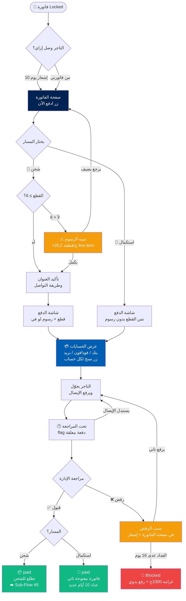

# 💳 Sub-Flow #4: الدفع (Payment)

> **Project:** BlueBee-Eg B2B Wholesale Platform
> **Module:** `invoice_deadline` (Odoo 17)
> **Phase:** 1 — UX Planning
> **Status:** 🟡 Draft — في انتظار مراجعة شريف
> **Date:** June 2026
> **Scope:** يغطي رحلة التاجر من لحظة طلب الدفع لفاتورة Locked، مروراً باختيار المسار (شحن أو استكمال)، شاشة الدفع (عرض الحسابات + نسخ + رفع إيصال التحويل)، شاشة المراجعة، ونتيجة المراجعة (قبول أو رفض). بيشمل سيناريوهات الغرامة والبلوك من جهة التاجر.
> **Scope note:** Covers the merchant journey from requesting payment on a Locked invoice, through path choice (Shipping or Continuation), the payment screen (account display + copy + transfer receipt upload), the review screen, and the review outcome (approved or rejected). Includes penalty and block scenarios from the merchant side.

---

## 📋 جدول المحتويات | Table of Contents

1. [الهدف من الـ Flow](#الهدف)
2. [النطاق والربط مع باقي الـ Flows](#النطاق)
3. [القرارات المعمارية](#القرارات-المعمارية)
4. [الفرق الجوهري: شحن vs استكمال](#شحن-vs-استكمال)
5. [نقاط الدخول](#نقاط-الدخول)
6. [URL Structure](#url-structure)
7. [Sub-Flow Diagram](#sub-flow-diagram)
8. [Wireframes](#wireframes)
9. [منطق الرسوم والحد الأدنى](#الرسوم)
10. [منطق رفع الإيصال والمراجعة](#الإيصال)
11. [Security: Defense in Depth](#security)
12. [Empty States & Edge Cases](#edge-cases)
13. [Performance Targets](#performance)
14. [Inputs لـ Claude Design](#inputs-لـ-claude-design)
15. [Implementation Notes for Claude Code](#implementation)
16. [Acceptance Criteria](#acceptance)

---

<a name="الهدف"></a>
## 🎯 الهدف من الـ Flow | Flow Goals

الدفع هو **نقطة إغلاق الالتزام** — اللحظة اللي بيتحوّل فيها الحجز لمعاملة مالية فعلية. الهدف:

Payment is **the commitment-closing point** — the moment a booking becomes an actual financial transaction. Goals:

1. **يدفع بثقة وبأقل احتكاك** — حسابات واضحة، نسخ بضغطة، رفع إيصال بسيط
   Pay with confidence and minimal friction — clear accounts, one-tap copy, simple receipt upload

2. **يفهم الفرق بين الشحن والاستكمال قبل ما يختار** — قرار الشحن نهائي، الاستكمال يفضّل الباب مفتوح
   Understand Shipping vs Continuation before choosing — Shipping is final, Continuation keeps the door open

3. **يعرف فين فلوسه رايحة** — تفصيل الفاتورة واضح (قطع + رسوم لو في)
   Know where the money goes — clear invoice breakdown (pieces + surcharge if any)

4. **يطمّن إن دفعته وصلت** — شاشة "تحت المراجعة" واضحة، مش معلّق في الفراغ
   Reassurance the payment landed — clear "under review" screen, not left hanging

5. **يفهم سبب الرفض ويقدر يتصرف** — لو الإدارة رفضت، السبب واضح وممكن يرفع تاني
   Understand rejection and act — if admin rejects, reason is clear and he can re-upload

---

<a name="النطاق"></a>
## 🔗 النطاق والربط مع باقي الـ Flows | Scope & Connections

هذا الـ Sub-Flow بيبدأ من **فاتورة في حالة Locked** وبينتهي عند **واحدة من نتيجتين:** الفاتورة `paid` (واتشحنت أو رجعت مفتوحة للاستكمال)، أو فضلت `locked` (رفض الدفع).

This Sub-Flow starts from a **Locked invoice** and ends at **one of two outcomes:** invoice `paid` (shipped or reopened for continuation), or stays `locked` (payment rejected).

| المرحلة Stage | الوصف Description |
|---|---|
| نقطة الدخول | إشعار يوم 10 **أو** زر "ادفع الآن" من صفحة الفاتورة |
| اختيار المسار | شحن (Shipping) أو استكمال (Continuation) |
| شاشة الدفع | عرض الحسابات + نسخ + رفع إيصال التحويل |
| تحت المراجعة | الفاتورة `locked` مع flag دفعة معلقة، التاجر يقدر يستبدل الإيصال |
| النتيجة | قبول (`paid`) أو رفض (يفضل `locked` + سبب) |

### الربط مع Sub-Flows التانية | Connections to Other Sub-Flows

- **Sub-Flow #3 (Cart):** الفاتورة بتتولد Open من الـ Confirm، وبعدين بتتقفل (يدوي أو cron) → تدخل هنا
- **Sub-Flow #5 (Post-order):** بعد القبول، عرض الفاتورة المدفوعة وحالة الشحن. وبيعرض كمان الفواتير الـ Locked والـ Grace والـ Blocked
- **Sub-Flow #6 (Onboarding):** التاجر الجديد بيتعلّم إزاي يدفع

> **حد فاصل مهم:** هذا الـ Sub-Flow بيغطي **رفع الإيصال لحد المراجعة**. تتبّع الشحن الفعلي بعد القبول، وعرض تاريخ الفواتير، موضوع Sub-Flow #5.
>
> **Important boundary:** This Sub-Flow covers **receipt upload up to review**. Actual shipment tracking after approval and invoice history display belong to Sub-Flow #5.

---

<a name="القرارات-المعمارية"></a>
## ✅ القرارات المعمارية | Architectural Decisions

| # | القرار Decision | الاختيار Choice | السبب Rationale |
|---|---|---|---|
| 1 | نقطة الدخول Entry point | **مزدوجة: إشعار يوم 10 + زر "ادفع الآن" في صفحة الفاتورة** | التاجر ممكن يفوّت الإشعار، فلازم يلاقي طريقه للفاتورة بنفسه |
| 2 | شاشة الدفع Payment screen | **موحّدة للمسارين (شحن واستكمال)** — نفس عرض الحسابات + النسخ + الرفع | تقليل التعقيد، نفس آلية التحويل اليدوي في المسارين |
| 3 | الفرق بين المسارين Path difference | **في المبلغ والنتيجة فقط** — مش في شكل الشاشة | الشحن: قطع + رسوم لو ناقص، نهائي. الاستكمال: قطع بس، الفاتورة ترجع مفتوحة |
| 4 | الحد الأدنى في الاستكمال Continuation minimum | **مفيش حد أدنى** — يدفع تمن القطع المحجوزة مهما كانت، الرسوم وقت التقفيل النهائي بس | الاستكمال مرحلة بناء، مش تسليم — الحد الأدنى يخص الشحن فقط |
| 5 | استبدال الإيصال Receipt replacement | **متاح طول ما الدفعة معلقة** (الفاتورة locked + flag) — الإدارة بتأكد على آخر صورة موجودة | أبسط في الكود + يقلّل ضغط خدمة العملاء للأخطاء البسيطة |
| 6 | طريقة الدفع Payment method | **تحويل يدوي بس** (بنك / فودافون كاش / بريد) — مفيش بوابة دفع أونلاين | Phase 1، الواقع الحالي للشركة، مفيش integration |
| 7 | تأكيد الدفع Payment confirmation | **مراجعة إدارية يدوية** — مفيش auto-confirm | الشركة عايزة تتحقق من كل تحويل، نفس النظام الحالي |
| 8 | عرض الحسابات Account display | **كل الحسابات ظاهرة + زر نسخ لكل واحد** | التاجر يختار اللي يناسبه، النسخ يمنع الأخطاء في الأرقام |
| 9 | تنبيه ضريبة فودافون كاش Vodafone fee notice | **تنبيه واضح: +1% على تحويل فودافون كاش** (الشركة بتخصمها) | شفافية، موجود في سياسة الشركة الحالية |
| 10 | الرفض Rejection | **الفاتورة تفضل locked + سبب مكتوب في صفحة الفاتورة + إشعار** | التاجر يفهم ويتصرف، العداد بيكمل في الخلفية |
| 11 | الغرامة والبلوك Penalty & block | **عرض فقط من جهة التاجر** — رفع الحظر قرار إداري يدوي بعد دفع الفاتورة + غرامة 1000ج | مفيش self-service للبلوك، حماية الشركة |
| 12 | تأكيد العنوان (شحن بس) Address (shipping only) | **يأكد العنوان وطريقة التواصل في مسار الشحن فقط** | الاستكمال مالوش شحن، فمش محتاج عنوان |
| 13 | الإلغاء بعد الدفع Cancel after payment | **مفيش إلغاء ذاتي** — خدمة العملاء فقط (قرار إداري) | موثّق في BUSINESS_LOGIC قسم 3.1 |
| 14 | عرض الرسوم Surcharge display | **line item داخل الفاتورة** (شفافية) عند الشحن لو القطع < 6 | التاجر يشوف بالظبط على إيه بيدفع |
| 15 | الـ Bilingual | **كل الشاشات AR/EN، CSS Logical Properties، أرقام الحسابات LTR دايماً** | أرقام الحسابات والـ IBAN لاتينية، تفضل LTR حتى في AR |

---

<a name="شحن-vs-استكمال"></a>
## ⚖️ الفرق الجوهري: شحن vs استكمال | Shipping vs Continuation

ده أهم مفهوم في الـ Sub-Flow ده. التاجر بيختار مرة واحدة، والاختيار بيحدد مصير الفاتورة.

This is the most important concept. The merchant chooses once, and the choice decides the invoice's fate.

| | 🚚 شحن (Shipping) | 🔁 استكمال (Continuation) |
|---|---|---|
| الفكرة Idea | "خلّصت، اشحنلي" | "لسه بكمّل، احجزلي اللي اخترته" |
| المبلغ Amount | تمن القطع **+ رسوم 25ج/قطعة لو < 6** | تمن القطع المحجوزة **بدون رسوم** |
| الحد الأدنى Minimum | 6 قطع (وإلا رسوم) | **مفيش** — أي عدد |
| العنوان Address | **يأكد العنوان وطريقة التواصل** | مش مطلوب |
| بعد القبول After approval | الفاتورة `paid` → تطلع للشحن | الفاتورة `paid` → ترجع مفتوحة للإضافة لحد 20 قطعة |
| العداد Counter | خلاص، الفاتورة اتقفلت | **عداد 10 أيام جديد يبدأ** |
| الرجوع Reversibility | **نهائي** — مفيش رجوع | يقدر يحوّل لشحن بعدين ⚠️ **مش العكس** |

### اللحظة الحاسمة: اختيار المسار

```
📄 فاتورة Locked
       │
       ├──[شحن]──► دفع (قطع + رسوم لو <6) ──► paid ──► 🚚 شحن (نهائي)
       │
       └──[استكمال]──► دفع (قطع بس، بدون رسوم) ──► paid ──► 🔁 فاتورة مفتوحة تاني
                                                              (عداد 10 أيام جديد، لحد 20 قطعة)
```

> **القاعدة الذهبية:** الشحن قرار نهائي لا رجوع فيه. الاستكمال بيفضّل الباب مفتوح بس بيلزمك تدفع تمن اللي حجزته دلوقتي.
>
> **Golden rule:** Shipping is final and irreversible. Continuation keeps the door open but requires you to pay for what you booked now.

> ⚠️ **تنبيه مهم للتصميم:** التاجر **لازم** يفهم الفرق ده **قبل** ما يضغط. شاشة اختيار المسار محتاجة توضّح العواقب بصرياً (خصوصاً إن الشحن نهائي).
>
> ⚠️ **Important design note:** The merchant **must** understand this difference **before** clicking. The path-choice screen needs to visually clarify consequences (especially Shipping being final).

---

<a name="نقاط-الدخول"></a>
## 🚪 نقاط الدخول | Entry Points

في طريقتين التاجر يوصل بيهم لشاشة الدفع:

There are two ways the merchant reaches the payment screen:

### 1️⃣ من الإشعار (يوم 10) | From notification (day 10)

- لما الفاتورة تتقفل تلقائياً بعد 10 أيام (عبر cron)، التاجر بيوصله:
  - 🔔 In-app notification أعلى الصفحة
  - 📧 Email (Phase 1)
  - 📱 Push notification (**Phase 2** — يتطلب PWA)
- الإشعار فيه زر مباشر "اعرض الفاتورة وادفع" → بيودّي لصفحة الفاتورة

### 2️⃣ من صفحة الفاتورة | From invoice page

- التاجر يدخل "فاتورتي" من الـ Navbar (موجود من Sub-Flow #1)
- لو الفاتورة `locked`، بيظهر زر بارز "ادفع الآن"
- التاجر كمان يقدر **يطلب الدفع بنفسه** قبل الـ 10 أيام (يقفل الفاتورة يدوياً) من نفس الصفحة

> **ملاحظة:** الطلب اليدوي للدفع (قبل الـ 10 أيام) بيقفل الفاتورة (`open → locked`) وبعدها نفس الـ flow. ده موثّق في BUSINESS_LOGIC قسم 1 (الـ locked بيحصل بطريقتين: cron أو طلب يدوي).
>
> **Note:** Manual payment request (before day 10) locks the invoice (`open → locked`) then the same flow follows.

---

<a name="url-structure"></a>
## 🌐 URL Structure

```
/my/invoices/<id>                  → صفحة الفاتورة (من Sub-Flow #5، نقطة الدخول هنا)
/my/invoices/<id>/pay              → شاشة اختيار المسار + الدفع
/my/invoices/<id>/pay/shipping     → مسار الشحن (تأكيد العنوان + الدفع)
/my/invoices/<id>/pay/continue     → مسار الاستكمال (الدفع المباشر)
/my/invoices/<id>/pay/review       → شاشة "تحت المراجعة"
```

> الـ upload action بيـ POST لـ controller endpoint (مثلاً `/my/invoices/<id>/pay/submit`) بيرفع الإيصال + يحط flag الدفعة المعلقة.
>
> رفع الإيصال بيدعم استبدال — POST تاني على نفس الـ endpoint بيستبدل الصورة طول ما الدفعة معلقة.

---

<a name="sub-flow-diagram"></a>
## 🔀 Sub-Flow Diagram



---

<a name="wireframes"></a>
## 🖼️ Wireframes

### 1️⃣ صفحة الفاتورة (Locked) — نقطة الدخول (Arabic RTL)

```
┌────────────────────────────────────────────────────────────────────────┐
│ 🐝 BlueBee | المتجر ▾  العروض  فاتورتي | 🔍 [AR|EN] 👤أحمد 🛒          │
├────────────────────────────────────────────────────────────────────────┤
│ الرئيسية > فاتورتي > فاتورة #1042                                       │
│                                                                        │
│  ┌──────────────────────────────────────────────────────────────┐     │
│  │ فاتورة #1042                          🟧 مقفولة — مطلوب الدفع  │     │
│  │ ────────────────────────────────────────────────────────────  │     │
│  │ ⏳ باقي على انتهاء المهلة: 4 أيام                              │     │
│  │                                                                │     │
│  │ 3 × طقم بيتي قطن (مقاس M، أزرق) ............... 255 ج          │     │
│  │ 2 × فانلة قطن (مقاس 6س، أبيض) ................. 90 ج           │     │
│  │ ────────────────────────────────────────────────────────────  │     │
│  │ عدد القطع: 5                                                   │     │
│  │ الإجمالي: 345 ج                                                │     │
│  │                                                                │     │
│  │              ┌──────────────────────────┐                     │     │
│  │              │      ادفع الآن            │                     │     │
│  │              └──────────────────────────┘                     │     │
│  │              📦 حمّل صور الفاتورة                              │     │
│  └──────────────────────────────────────────────────────────────┘     │
└────────────────────────────────────────────────────────────────────────┘
```

**ملاحظات:**
- الـ badge بيوضّح الحالة (🟧 مقفولة)
- عداد المهلة المتبقية واضح (من الـ grace logic)
- زر "ادفع الآن" بارز
- زر تحميل الصور موجود هنا كمان (من Sub-Flow #3، القرار #11)

---

### 2️⃣ شاشة اختيار المسار (Arabic RTL)

```
┌────────────────────────────────────────────────────────────────────────┐
│ 🐝 BlueBee | ...                                                       │
├────────────────────────────────────────────────────────────────────────┤
│ الرئيسية > فاتورتي > #1042 > الدفع                                      │
│                                                                        │
│            اختار طريقة إتمام فاتورتك                                    │
│                                                                        │
│  ┌────────────────────────────┐   ┌────────────────────────────┐      │
│  │         🚚                  │   │         🔁                  │      │
│  │       شحن الطلب             │   │     استكمال الحجز           │      │
│  │ ────────────────────────   │   │ ────────────────────────   │      │
│  │ تدفع وتستلم بضاعتك          │   │ تدفع اللي حجزته دلوقتي      │      │
│  │                            │   │ وتفضل تضيف لحد 20 قطعة      │      │
│  │ • الحد الأدنى 6 قطع         │   │ • بدون حد أدنى              │      │
│  │ • أقل من 6 = رسوم 25ج/قطعة  │   │ • بدون رسوم دلوقتي          │      │
│  │ • قرار نهائي ⚠️             │   │ • عداد 10 أيام جديد         │      │
│  │                            │   │ • تقدر تحوّل لشحن بعدين      │      │
│  │ ┌────────────────────────┐ │   │ ┌────────────────────────┐ │      │
│  │ │      اختار الشحن        │ │   │ │     اختار الاستكمال     │ │      │
│  │ └────────────────────────┘ │   │ └────────────────────────┘ │      │
│  └────────────────────────────┘   └────────────────────────────┘      │
│                                                                        │
│  ℹ️ الشحن قرار نهائي. الاستكمال يفضّل فاتورتك مفتوحة لكن مش بيرجع شحن.   │
└────────────────────────────────────────────────────────────────────────┘
```

**ملاحظات:**
- كارتين متجاورين، الفرق واضح بصرياً
- تحذير "قرار نهائي" على الشحن بلون تحذيري
- الـ disclaimer تحت بيلخّص الفرق
- في Mobile: الكارتين فوق بعض (stacked)

---

### 3️⃣ تنبيه الرسوم (لو الشحن بأقل من 6 قطع) — Modal

```
        ┌──────────────────────────────────────────────┐
        │                                           ✕  │
        │                  ⚠️                            │
        │                                                │
        │     طلبك أقل من الحد الأدنى (6 قطع)            │
        │                                                │
        │     فاتورتك فيها 5 قطع. الشحن بأقل من 6 قطع     │
        │     بيضيف رسوم 25ج لكل قطعة.                    │
        │                                                │
        │     ┌────────────────────────────────────┐     │
        │     │ تمن القطع .................. 345 ج │     │
        │     │ رسوم أقل من الحد (5 قطع) ... 125 ج │     │
        │     │ ──────────────────────────────────  │     │
        │     │ الإجمالي ................... 470 ج │     │
        │     └────────────────────────────────────┘     │
        │                                                │
        │   ┌──────────────────┐  ┌──────────────────┐  │
        │   │  ارجع أضيف قطع    │  │  أكمل بالرسوم     │  │
        │   └──────────────────┘  └──────────────────┘  │
        └──────────────────────────────────────────────┘
```

**ملاحظات:**
- التفصيل واضح: تمن القطع + الرسوم كـ line item منفصل + الإجمالي
- خياران: يرجع يضيف (يوفّر الرسوم) أو يكمل بالرسوم
- "ارجع أضيف قطع" بيرجّعه لصفحة الفاتورة/التصفح

> **ملاحظة منطقية:** التنبيه ده بيظهر في مسار **الشحن فقط**. في الاستكمال مفيش رسوم ولا حد أدنى.

---

### 4️⃣ تأكيد العنوان (مسار الشحن فقط) — Arabic RTL

```
┌────────────────────────────────────────────────────────────────────────┐
│ 🐝 BlueBee | ...                                                       │
├────────────────────────────────────────────────────────────────────────┤
│ الرئيسية > فاتورتي > #1042 > الدفع > الشحن                              │
│                                                                        │
│  ┌──── بيانات الشحن ──────────────────────────────────────────┐        │
│  │                                                             │        │
│  │  الاسم:        [ أحمد محمد                              ]    │        │
│  │  المحافظة:     [ الدقهلية                          ▾  ]    │        │
│  │  العنوان:      [ المنصورة - شارع الجمهورية - بجوار...   ]    │        │
│  │  رقم التواصل:  [ 01012345678                          ]    │        │
│  │                                                             │        │
│  │  ℹ️ للمحافظات: دفع مسبق ثم الشحن.                            │        │
│  │     داخل المنصورة: ممكن الدفع مع المندوب.                    │        │
│  │                                                             │        │
│  │              ┌──────────────────────────┐                  │        │
│  │              │   تأكيد ومتابعة الدفع     │                  │        │
│  │              └──────────────────────────┘                  │        │
│  └─────────────────────────────────────────────────────────────┘       │
└────────────────────────────────────────────────────────────────────────┘
```

**ملاحظات:**
- الحقول بتتعبّى مسبقاً من بيانات التاجر (من الـ onboarding) ويقدر يعدّلها
- التنبيه بيوضّح فرق الدفع بين المحافظات والمنصورة (من سياسة الشركة)
- ده الفرق الوحيد في الـ UI بين الشحن والاستكمال — بعد كده نفس شاشة الدفع

---

### 5️⃣ شاشة الدفع — عرض الحسابات (موحّدة للمسارين) — Arabic RTL

```
┌────────────────────────────────────────────────────────────────────────┐
│ 🐝 BlueBee | ...                                                       │
├────────────────────────────────────────────────────────────────────────┤
│ الرئيسية > فاتورتي > #1042 > الدفع                                      │
│                                                                        │
│  ┌──── المبلغ المطلوب ────────────────────────────────────────┐         │
│  │  الإجمالي: 470 ج   (شامل رسوم أقل من الحد: 125 ج)           │         │
│  └─────────────────────────────────────────────────────────────┘       │
│                                                                        │
│  حوّل المبلغ على أي حساب من دول، وارفع صورة التحويل:                    │
│                                                                        │
│  ┌──── 🏦 حساب بنكي ──────────────────────────────────────────┐         │
│  │  بنك مصر — أحمد ... — 1234567890123          [📋 انسخ]      │         │
│  │  بدون أي زيادة                                              │         │
│  └─────────────────────────────────────────────────────────────┘       │
│  ┌──── 📱 فودافون كاش ────────────────────────────────────────┐         │
│  │  01080811579                                 [📋 انسخ]      │         │
│  │  ⚠️ زيادة 1% ضريبة على التحويل (الشركة بتخصمها)            │         │
│  └─────────────────────────────────────────────────────────────┘       │
│  ┌──── 📮 حساب البريد المصري ─────────────────────────────────┐         │
│  │  رقم الحساب: 98765432                        [📋 انسخ]      │         │
│  │  بدون أي زيادة                                              │         │
│  └─────────────────────────────────────────────────────────────┘       │
│                                                                        │
│  ┌──── صورة التحويل ─────────────────────────────────────────┐          │
│  │     📎 اسحب الصورة هنا أو [ اختار ملف ]                    │          │
│  │     ملاحظة (اختياري): [                              ]      │          │
│  └─────────────────────────────────────────────────────────────┘       │
│                                                                        │
│              ┌──────────────────────────┐                              │
│              │      أرسل للمراجعة        │                              │
│              └──────────────────────────┘                              │
└────────────────────────────────────────────────────────────────────────┘
```

**ملاحظات:**
- المبلغ المطلوب بارز فوق
- كل حساب في كارت منفصل + زر "انسخ" (ينسخ الرقم بس)
- **أرقام الحسابات LTR دايماً** حتى في الواجهة العربية
- تنبيه ضريبة الـ 1% على فودافون كاش واضح (من سياسة الشركة)
- منطقة رفع الصورة + ملاحظة اختيارية
- زر "أرسل للمراجعة" disabled لحد ما يترفع صورة (+ backend validation)

---

### 6️⃣ شاشة تحت المراجعة (Arabic RTL)

```
┌────────────────────────────────────────────────────────────────────────┐
│ 🐝 BlueBee | ...                                                       │
├────────────────────────────────────────────────────────────────────────┤
│                                                                        │
│                            🕐                                          │
│                                                                        │
│                  دفعتك تحت المراجعة                                     │
│                                                                        │
│        استلمنا إيصال التحويل لفاتورة #1042 (470 ج).                    │
│        الإدارة بتراجع التحويل من 10 ص لـ 6 م (عدا الجمعة).             │
│        هنبعتلك إشعار أول ما تتأكد.                                      │
│                                                                        │
│  ┌──── الإيصال المرفوع ──────────────────────────────────────┐          │
│  │   ┌────────┐                                               │          │
│  │   │ 🖼️ IMG │   transfer_receipt.jpg                        │          │
│  │   └────────┘   [ استبدل الصورة ]                           │          │
│  └─────────────────────────────────────────────────────────────┘       │
│                                                                        │
│              ┌──────────────────────────┐                              │
│              │     ارجع للفاتورة         │                              │
│              └──────────────────────────┘                              │
└────────────────────────────────────────────────────────────────────────┘
```

**ملاحظات:**
- رسالة طمأنة واضحة + مواعيد المراجعة (من سياسة الشركة: 10-6 عدا الجمعة)
- معاينة الإيصال المرفوع + زر "استبدل الصورة" (متاح طول ما الدفعة معلقة — القرار #5)
- مفيش polling إجباري — التاجر يرجع أو يستنى الإشعار

---

### 7️⃣ نتيجة المراجعة — قبول (Arabic RTL)

```
        ┌──────────────────────────────────────────────┐
        │                  ✅                            │
        │                                                │
        │        تم تأكيد دفعتك بنجاح                     │
        │                                                │
        │   ── لو شحن ──                                 │
        │   فاتورة #1042 دخلت مرحلة التجهيز للشحن.        │
        │   هنتواصل معاك لتأكيد موعد التسليم.             │
        │                                                │
        │   ── لو استكمال ──                             │
        │   فاتورتك رجعت مفتوحة! تقدر تضيف لحد 20 قطعة.   │
        │   عندك 10 أيام جديدة. الباقي: 15 قطعة.          │
        │                                                │
        │   ┌──────────────────┐  ┌──────────────────┐  │
        │   │  اعرض الفاتورة    │  │  كمّل تسوّق        │  │
        │   └──────────────────┘  └──────────────────┘  │
        └──────────────────────────────────────────────┘
```

**ملاحظات:**
- الرسالة بتختلف حسب المسار (شحن vs استكمال)
- في الاستكمال: بيوضّح الباقي للحد الأقصى (20 قطعة) + العداد الجديد
- في الاستكمال: زر "كمّل تسوّق" بيرجّعه للتصفح

---

### 8️⃣ نتيجة المراجعة — رفض (Arabic RTL)

```
┌────────────────────────────────────────────────────────────────────────┐
│  ┌──────────────────────────────────────────────────────────────┐     │
│  │ فاتورة #1042                          🟧 مقفولة — الدفع مرفوض  │     │
│  │ ────────────────────────────────────────────────────────────  │     │
│  │ ❌ تم رفض الدفعة المرفوعة                                       │     │
│  │                                                                │     │
│  │ السبب: صورة التحويل غير واضحة / المبلغ المحوّل أقل من المطلوب.   │     │
│  │                                                                │     │
│  │ برجاء مراجعة التحويل ورفع إيصال صحيح.                           │     │
│  │ ⏳ باقي على انتهاء المهلة: 2 يوم                               │     │
│  │                                                                │     │
│  │              ┌──────────────────────────┐                     │     │
│  │              │      ارفع إيصال جديد      │                     │     │
│  │              └──────────────────────────┘                     │     │
│  │              📞 تواصل مع خدمة العملاء                          │     │
│  └──────────────────────────────────────────────────────────────┘     │
└────────────────────────────────────────────────────────────────────────┘
```

**ملاحظات:**
- سبب الرفض **دائم في صفحة الفاتورة** (Phase 1) + إشعار مؤقت (موثّق في BUSINESS_LOGIC قسم 7)
- زر "ارفع إيصال جديد" بيرجّعه لشاشة الدفع
- العداد بيكمل في الخلفية — التحذير بالمهلة المتبقية واضح
- زر تواصل مع خدمة العملاء

---

### 9️⃣ شاشة الحظر (Blocked) — من جهة التاجر

```
┌────────────────────────────────────────────────────────────────────────┐
│                            🚫                                          │
│                                                                        │
│                  حسابك موقوف مؤقتاً                                     │
│                                                                        │
│        فيه فاتورة مستحقة لم يتم دفعها خلال المهلة المحددة.              │
│        لإعادة تفعيل حسابك، يلزم:                                        │
│                                                                        │
│        • دفع الفاتورة المستحقة (#1042)                                  │
│        • غرامة 1000 ج                                                   │
│                                                                        │
│        بعد الدفع، الإدارة بتراجع وبترفع الإيقاف يدوياً.                 │
│                                                                        │
│              ┌──────────────────────────┐                              │
│              │   📞 تواصل مع الإدارة      │                              │
│              └──────────────────────────┘                              │
└────────────────────────────────────────────────────────────────────────┘
```

**ملاحظات:**
- Full-page block (زي Sub-Flow #3، القرار #10) — مفيش access للموقع
- بيوضّح الخطوات المطلوبة (فاتورة + غرامة 1000ج)
- **رفع الحظر قرار إداري يدوي** — مفيش self-service (القرار #11)
- زر تواصل بس

