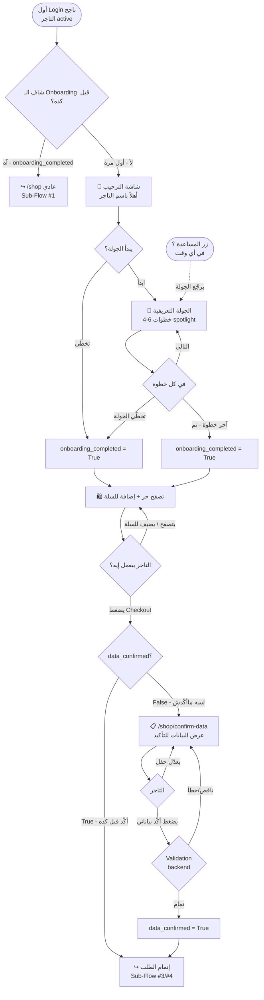

# 🚀 Sub-Flow #6: الإعداد الأول للتاجر (Onboarding)

> **Project:** BlueBee-Eg B2B Wholesale Platform
> **Module:** `invoice_deadline` (Odoo 17)
> **Phase:** 1 — UX Planning
> **Status:** 🟡 Draft — في انتظار مراجعة شريف
> **Date:** June 2026
> **Scope:** يغطي أول تجربة للتاجر بعد ما الإدارة تقبل طلبه ويعمل أول Login — من تأكيد البيانات التشغيلية الناقصة (gate)، لجولة تعريفية اختيارية بتشرح نظام الموقع (الفاتورة، الـ 10 أيام، الاستكمال، الغرامة)، لحظة الـ Checkout gate اللي بتمنع إتمام أول طلب قبل اكتمال البيانات. آخر Sub-Flow قبل الـ handoff لـ Claude Design.
> **Scope note:** Covers the merchant's first experience after admin approval and first Login — from confirming missing operational data (gate), to an optional guided tour explaining the platform (invoice, 10 days, continuation, penalty), to the Checkout gate that blocks completing the first order before data is complete. The last Sub-Flow before handoff to Claude Design.

---

## 📋 جدول المحتويات | Table of Contents

1. [الهدف من الـ Flow](#الهدف)
2. [النطاق والربط مع باقي الـ Flows](#النطاق)
3. [القرار المحوري: تداخل البيانات مع الـ Application](#تداخل-البيانات)
4. [القرارات المعمارية](#القرارات-المعمارية)
5. [بنية الـ Onboarding: جزء إجباري + جولة اختيارية](#بنية-الاونبوردنج)
6. [خريطة حالات التاجر (res.partner)](#خريطة-الحالات)
7. [URL Structure](#url-structure)
8. [Sub-Flow Diagram](#sub-flow-diagram)
9. [Wireframes](#wireframes)
10. [منطق الـ Checkout Gate](#checkout-gate)
11. [Security: Defense in Depth](#security)
12. [Empty States & Edge Cases](#edge-cases)
13. [Performance Targets](#performance)
14. [Inputs لـ Claude Design](#inputs-لـ-claude-design)
15. [Implementation Notes for Claude Code](#implementation)
16. [Acceptance Criteria](#acceptance)

---

<a name="الهدف"></a>
## 🎯 الهدف من الـ Flow | Flow Goals

الـ Onboarding هو **أول انطباع داخل الموقع** — التاجر القديم اللي كان بيتعامل بالتليجرام والواتساب بيدخل لأول مرة على نظام مختلف تماماً. الهدف:

Onboarding is **the first impression inside the platform** — the existing merchant, used to Telegram and WhatsApp, enters a completely different system for the first time. Goals:

1. **يحس إنه مرحَّب بيه ومش تايه** — ترحيب واضح + توجيه، مش شاشة فاضية
   Feel welcomed and not lost — clear welcome + guidance, not an empty screen

2. **يفهم النظام الجديد قبل ما يلتزم** — الفاتورة، الـ 10 أيام، الاستكمال، الغرامة — قبل أول أوردر
   Understand the new system before committing — invoice, 10 days, continuation, penalty — before the first order

3. **يأكّد بياناته التشغيلية مرة واحدة** — العنوان، المحافظة، الموبايل — عشان أول طلب يمشي من غير احتكاك
   Confirm operational data once — address, governorate, mobile — so the first order flows without friction

4. **مايتحبسش بالقوة** — الجولة اختيارية وقابلة للتخطّي، التاجر المتمكّن يعدّيها
   Not forcibly trapped — the tour is optional and skippable, the savvy merchant skips it

5. **الاحتكاك الوحيد عند لحظة الفلوس** — يتصفح ويضيف للسلة بحرية، الـ gate الحقيقي عند Checkout بس
   The only friction is at the money moment — browse and add freely, the real gate is at Checkout only

> **مبدأ حاكم:** التاجر هنا غالباً **مش مرتاح للتكنولوجيا**. كل قرار في الـ Flow ده بيوازن بين "نوجّهه كفاية" و"منزهقوش". متسق مع كلام م. نانسي: "مساعدتهم تقنياً حتى يعتادوا على النظام الجديد".
>
> **Guiding principle:** The merchant here is often **not tech-comfortable**. Every decision balances "guide him enough" against "don't frustrate him". Aligned with Eng. Nancy: "helping them technically until they get used to the new system".

---

<a name="النطاق"></a>
## 🔗 النطاق والربط مع باقي الـ Flows | Scope & Connections

هذا الـ Sub-Flow بيبدأ من **أول Login ناجح للتاجر المعتمد (active)** وبيغطي تجربته الأولى لحد ما يكون جاهز يستخدم الموقع زي أي تاجر قديم.

This Sub-Flow starts from **the approved merchant's first successful Login (active)** and covers his first experience until he's ready to use the platform like any returning merchant.

| المرحلة Stage | الوصف Description |
|---|---|
| Welcome Screen | شاشة ترحيب أول دخول + نقطة البداية للجولة |
| Data Confirmation (Gate) | تأكيد/استكمال البيانات التشغيلية الناقصة فقط |
| Guided Tour (Skippable) | جولة تعريفية بتشرح النظام — قابلة للتخطّي |
| First Browse | التاجر بيتصفح ويضيف للسلة بحرية |
| Checkout Gate | لو حاول يـ Checkout والبيانات ناقصة → يكمّلها الأول |

### الربط مع Sub-Flows التانية | Connections to Other Sub-Flows

- **Sub-Flow #0 (Application):** بعد `action_approve_application` التاجر بيبقى `active` ويستلم invitation → أول Login بيدخل هنا
- **Sub-Flow #1 (Home):** بعد ما الـ Onboarding يخلص (أو يتخطّى)، التاجر بيكمل على الهوم العادي
- **Sub-Flow #3 (Cart):** التاجر يقدر يضيف للسلة أثناء/بعد الـ Onboarding — الـ Checkout هو نقطة الـ gate
- **Sub-Flow #2 (Search):** التصفح متاح بالكامل من أول دخول

> **حد فاصل مهم:** الـ Onboarding بيخلص عند **اكتمال البيانات + إغلاق/تخطّي الجولة**. بعد كده التاجر "عادي" — مايشوفش الـ Onboarding تاني. أي تعديل لاحق للبيانات موضوع صفحة الحساب (مش هنا).
>
> **Important boundary:** Onboarding ends at **data completion + closing/skipping the tour**. After that the merchant is "normal" — never sees Onboarding again. Later data edits belong to the account page (not here).

---

<a name="تداخل-البيانات"></a>
## 🧩 القرار المحوري: تداخل البيانات مع الـ Application | Data Overlap with Application

> ⚠️ **اكتشاف مهم أثناء كتابة هذا الـ Flow:** فورم الـ Application في `00_landing_and_application.md` **بيجمع بالفعل**: الاسم، الواتساب، الإيميل، لينك الجروب، **المحافظة، والعنوان التفصيلي**، ونوع النشاط.
>
> ⚠️ **Important finding while writing this Flow:** The Application form in `00` **already collects**: name, WhatsApp, email, group link, **governorate, detailed address**, and business type.

ده معناه إن **معظم البيانات التشغيلية موجودة قبل أول Login**. فالـ Onboarding **مش بيجمع بيانات من الصفر** — هو بيعمل حاجتين:

This means **most operational data exists before first Login**. So Onboarding **doesn't collect data from scratch** — it does two things:

1. **يعرض البيانات للتأكيد (Confirm & Edit):** التاجر يشوف اللي الإدارة سجّلته ويأكّد إنه صح أو يعدّله. لأن البيانات اتسجّلت من شهور أو اتكتبت بسرعة وقت التقديم.
   **Displays data for confirmation (Confirm & Edit):** the merchant sees what admin recorded and confirms or edits it. Because data may be months old or hastily typed at application time.

2. **يطلب الناقص فقط (إن وُجد):** أي حقل تشغيلي مش مطلوب وقت التقديم بس محتاجينه للطلب (مثلاً تأكيد رقم موبايل للشحن لو مختلف عن الواتساب).
   **Requests only what's missing (if any):** any operational field not required at application but needed for ordering (e.g. confirming a delivery mobile if different from WhatsApp).

> **النتيجة:** الـ gate بقى **خفيف** — مجرد شاشة "أكّد بياناتك" مش فورم طويل. ده بيخفّف الاحتكاك جداً ويخلّي القرار "السلة قبل الـ Onboarding مسموحة" منطقي تماماً.
>
> **Result:** the gate is now **light** — a "confirm your data" screen, not a long form. This drastically reduces friction and makes "cart-before-Onboarding allowed" entirely sensible.

> **قرار مفتوح للحسم مع م. نانسي:** هل تأكيد البيانات **إجباري قبل أول Checkout** (توصيتنا) ولا **اختياري تماماً**؟ التوصية: إجباري قبل أول Checkout فقط، عشان نضمن صحة عنوان الشحن قبل أول شحنة. التصفح والإضافة للسلة يفضلوا أحرار.
>
> **Open decision for Eng. Nancy:** is data confirmation **mandatory before first Checkout** (our recommendation) or **fully optional**? Recommendation: mandatory before first Checkout only, to guarantee a valid shipping address before the first shipment. Browsing and adding to cart stay free.

---

<a name="القرارات-المعمارية"></a>
## ✅ القرارات المعمارية | Architectural Decisions

| # | القرار Decision | الاختيار Choice | السبب Rationale |
|---|---|---|---|
| 1 | متى يظهر الـ Onboarding | **تلقائي عند أول Login + قابل للتخطّي (skippable)** | التاجر القديم محتاج توجيه، لكن المتمكّن لازم يقدر يعدّيه — توازن بين الاتنين |
| 2 | بنية الـ Onboarding | **جزأين: تأكيد بيانات (gate خفيف) + جولة تعريفية (اختيارية)** | فصل الإجباري عن الاختياري — الإجباري ضروري للطلب، الاختياري للفهم |
| 3 | السلة قبل اكتمال الـ Onboarding | **مسموح يتصفح ويضيف بحرية** | مفيش سبب تقني يمنع — الاحتكاك بدري بيخسّر تجار |
| 4 | الـ Gate الحقيقي | **عند أول Checkout فقط** — لو البيانات ناقصة يكمّلها هناك | لحظة الفلوس والشحن هي اللحظة الوحيدة اللي بنحتاج فيها بيانات مؤكدة |
| 5 | تأكيد البيانات Data confirm | **عرض البيانات الموجودة (من الـ Application) للتأكيد/التعديل** مش جمع من الصفر | معظم البيانات اتجمعت في `00` — مفيش داعي لتكرار |
| 6 | تكرار الظهور | **مرة واحدة فقط** — بعد التخطّي/الإكمال مايظهرش تاني | flag على `res.partner` (`onboarding_completed`) |
| 7 | محتوى الجولة Tour content | **النظام المميّز فقط: الفاتورة، الـ 10 أيام، الاستكمال، الغرامة، إزاي يطلب** | نركّز على اللي **مختلف** عن تجربته القديمة، مش شرح كل زرار |
| 8 | شكل الجولة Tour format | **خطوات قصيرة (4-6) مع تمييز العنصر على الشاشة (spotlight/tooltip)** | أسهل للاستيعاب من فيديو أو نص طويل، وبيربط الشرح بالواجهة الفعلية |
| 9 | إعادة فتح الجولة | **متاحة من قائمة المساعدة (؟) في الـ Navbar في أي وقت** | التاجر ينسى — لازم يقدر يرجّعها من غير ما نجبره أول مرة |
| 10 | اللغة Bilingual | **عربي default + يحترم اختيار اللغة من الـ Navbar** | نفس قاعدة كل الموقع |
| 11 | النبرة Tone | **محايد جنسياً** — "أكّد بياناتك"، "ابدأ التصفح" | B2B + تجار من الجنسين |
| 12 | الترحيب Welcome | **شاشة ترحيب باسم التاجر مرة واحدة** قبل الجولة | لمسة إنسانية لأول دخول |

---

<a name="بنية-الاونبوردنج"></a>
## 🏗️ بنية الـ Onboarding | Onboarding Structure

الـ Onboarding بيتقسم **جزأين منفصلين** بأولويات مختلفة:

Onboarding splits into **two separate parts** with different priorities:

### 1️⃣ الجزء الإجباري — تأكيد البيانات (Light Gate)
### 1️⃣ Mandatory part — Data Confirmation (Light Gate)

```
عرض البيانات الموجودة (من الـ Application):
├── الاسم الثنائي ........... [موجود ✓ — قابل للتعديل]
├── رقم الواتساب ............ [موجود ✓ — قابل للتعديل]
├── المحافظة ................ [موجودة ✓ — قابلة للتعديل]
├── العنوان التفصيلي ........ [موجود ✓ — قابل للتعديل]
└── رقم موبايل الشحن ........ [تأكيد: نفس الواتساب؟ أو رقم تاني]

زر واحد: "أكّد بياناتي" → onboarding gate passed
```

> **مش فورم طويل** — معظم الحقول معبّاية. التاجر بيراجع ويأكّد. الإجبار الوحيد: مايقدرش يـ **Checkout** قبل ما يأكّد.
>
> **Not a long form** — most fields pre-filled. The merchant reviews and confirms. The only enforcement: can't **Checkout** before confirming.

### 2️⃣ الجزء الاختياري — الجولة التعريفية (Skippable Tour)
### 2️⃣ Optional part — Guided Tour (Skippable)

| الخطوة Step | الموضوع Topic | الرسالة Message |
|---|---|---|
| 1 | الترحيب Welcome | "أهلاً بيك في BlueBee — خلينا نوريك النظام في دقيقة" |
| 2 | التصفح والسلة Browse & Cart | "اتصفح، أضف للسلة، السلة بتفضل محفوظة على مدار أيام" |
| 3 | الفاتورة والـ 10 أيام Invoice & 10 days | "أول ما تأكّد طلبك بيبقى فاتورة — عندك 10 أيام تدفعها" |
| 4 | الاستكمال Continuation | "تقدر تضيف لفاتورتك بعد دفعة الاستكمال — لحد 20 قطعة" |
| 5 | الغرامة والحظر Penalty & Block | "لو الفاتورة معدّتش، فيه فترة سماح ثم غرامة — خلّي بالك من العداد" |
| 6 | الختام Done | "كده إنت جاهز — أي وقت تقدر ترجّع الجولة من زر المساعدة (؟)" |

> كل خطوة عليها زر **"تخطّي الجولة"** واضح + زر **"التالي"**. الخروج متاح في أي لحظة.
>
> Every step has a clear **"Skip tour"** button + **"Next"**. Exit is available at any moment.

> **ملاحظة محتوى:** الجولة بتشرح **اللي مختلف** عن تجربة التليجرام/الواتساب القديمة (الفاتورة، العداد، الاستكمال) — مش بتشرح كل زرار في الموقع.
>
> **Content note:** The tour explains **what's different** from the old Telegram/WhatsApp experience (invoice, counter, continuation) — not every button on the site.

---

<a name="خريطة-الحالات"></a>
## 🗺️ خريطة حالات التاجر | Merchant State Map (res.partner)

الـ Onboarding بيشتغل على تاجر في حالة `active` بس. الحالات المرتبطة:

Onboarding runs only on a merchant in `active` state. Related states:

| الحالة State | الوصف Description | يشوف الـ Onboarding؟ |
|---|---|---|
| `pending` | قدّم طلب، تحت المراجعة | ❌ مايقدرش يعمل Login أصلاً |
| `approved` | الإدارة قبلت، لسه ماعملش Login | ❌ لسه — بيستلم invitation |
| `active` | عمل Login، تاجر فعّال | ✅ أول Login → Onboarding |
| `rejected` | الإدارة رفضت | ❌ مفيش access |

### Flag الـ Onboarding على `res.partner`

```
onboarding_completed : Boolean (default False)
  ├── False → التاجر يشوف الـ Onboarding عند الدخول
  └── True  → التاجر عدّى الـ Onboarding (أكمل أو تخطّى) — مايظهرش تاني

data_confirmed : Boolean (default False)
  ├── False → الـ Checkout gate شغّال (لازم يأكّد قبل أول طلب)
  └── True  → التاجر أكّد بياناته — Checkout متاح
```

> **فصل مهم:** `onboarding_completed` (الجولة) منفصل عن `data_confirmed` (البيانات). التاجر ممكن يتخطّى الجولة بس لسه لازم يأكّد بياناته قبل الـ Checkout.
>
> **Important separation:** `onboarding_completed` (the tour) is separate from `data_confirmed` (the data). A merchant can skip the tour but still must confirm data before Checkout.

---

<a name="url-structure"></a>
## 🌐 URL Structure

```
/shop/welcome          → شاشة الترحيب + بداية الـ Onboarding (أول Login)
/shop/confirm-data     → شاشة تأكيد البيانات (الـ light gate)
/shop                  → الهوم — الجولة بتشتغل فوقه كـ overlay (مش URL منفصل)
```

> الجولة التعريفية **مش صفحة منفصلة** — هي overlay/spotlight بيشتغل فوق الهوم والصفحات العادية. التاجر بيشوف الموقع الحقيقي والشرح فوقه.
>
> الـ `data_confirmed` gate بيشتغل عند أي محاولة Checkout — لو False بيـ redirect لـ `/shop/confirm-data` ثم يرجّعه لإتمام الطلب.

---

<a name="sub-flow-diagram"></a>
## 🔀 Sub-Flow Diagram



---

<a name="wireframes"></a>
## 🖼️ Wireframes

### A. شاشة الترحيب | Welcome Screen (`/shop/welcome`)

```
┌─────────────────────────────────────────────┐
│  [Logo BlueBee]              [AR | EN]        │
├─────────────────────────────────────────────┤
│                                               │
│              👋                               │
│       أهلاً بيك يا [اسم التاجر]               │
│                                               │
│   إنت دلوقتي جزء من BlueBee. خلينا نوريك      │
│   النظام في أقل من دقيقة — أو ابدأ على طول.   │
│                                               │
│   ┌─────────────────┐  ┌──────────────────┐  │
│   │  ابدأ الجولة 🎯  │  │  تخطّي وابدأ الآن │  │
│   └─────────────────┘  └──────────────────┘  │
│                                               │
└─────────────────────────────────────────────┘
```

### B. تأكيد البيانات | Data Confirmation (`/shop/confirm-data`)

```
┌─────────────────────────────────────────────┐
│  أكّد بياناتك قبل أول طلب                      │
│  راجعنا البيانات دي معاك — عدّل أي حاجة لو     │
│  محتاج، وبعدين أكّد.                           │
├─────────────────────────────────────────────┤
│  الاسم الثنائي                                 │
│  ┌─────────────────────────────────────┐     │
│  │ [اسم التاجر — معبّى]                 │ ✏️  │
│  └─────────────────────────────────────┘     │
│  رقم الواتساب                                  │
│  ┌─────────────────────────────────────┐     │
│  │ [الرقم — معبّى]                     │ ✏️  │
│  └─────────────────────────────────────┘     │
│  المحافظة                                      │
│  ┌─────────────────────────────────────┐     │
│  │ [المحافظة — معبّاية] ▾              │     │
│  └─────────────────────────────────────┘     │
│  العنوان التفصيلي                              │
│  ┌─────────────────────────────────────┐     │
│  │ [العنوان — معبّى]                   │ ✏️  │
│  └─────────────────────────────────────┘     │
│  رقم موبايل الشحن                              │
│  ☑ نفس رقم الواتساب                            │
│  ┌─────────────────────────────────────┐     │
│  │ [رقم تاني — لو شال علامة الصح]      │     │
│  └─────────────────────────────────────┘     │
│                                               │
│         ┌──────────────────────────┐          │
│         │      أكّد بياناتي ✓       │          │
│         └──────────────────────────┘          │
└─────────────────────────────────────────────┘
```

### C. الجولة التعريفية | Guided Tour (Overlay على الهوم)

```
┌─────────────────────────────────────────────┐
│  [الهوم الحقيقي معتّم في الخلفية]             │
│                                               │
│        ┌───────────────────────────┐          │
│        │  🛒 [عنصر السلة مضيء]      │          │
│        └───────────────────────────┘          │
│   ┌─────────────────────────────────────┐    │
│   │  خطوة 3 من 6                         │    │
│   │  الفاتورة والـ 10 أيام               │    │
│   │  أول ما تأكّد طلبك بيبقى فاتورة —     │    │
│   │  عندك 10 أيام تدفعها قبل ما العداد    │    │
│   │  يخلص.                               │    │
│   │                                      │    │
│   │  ● ● ● ○ ○ ○                          │    │
│   │  [تخطّي الجولة]        [التالي →]     │    │
│   └─────────────────────────────────────┘    │
└─────────────────────────────────────────────┘
```

### D. Checkout Gate (لو البيانات لسه ماأكّدتش)

```
┌─────────────────────────────────────────────┐
│   خطوة أخيرة قبل إتمام طلبك                    │
│                                               │
│   عشان نضمن وصول طلبك صح، أكّد بياناتك         │
│   الأول — دقيقة واحدة بس.                      │
│                                               │
│        ┌──────────────────────────┐           │
│        │   أكّد بياناتي وأكمّل      │           │
│        └──────────────────────────┘           │
│                                               │
│   (السلة بتاعتك محفوظة — مش هتضيع)             │
└─────────────────────────────────────────────┘
```

---

<a name="checkout-gate"></a>
## 🚪 منطق الـ Checkout Gate | Checkout Gate Logic

ده **القلب التقني** للـ Flow. الـ gate الوحيد الإجباري:

This is the **technical heart** of the Flow. The only mandatory gate:

```
التاجر يضغط "إتمام الطلب" (Checkout)
        │
        ▼
   data_confirmed == True ؟
        │
   ┌────┴────┐
   │         │
  آه        لأ
   │         │
   ▼         ▼
إتمام     redirect لـ /shop/confirm-data
الطلب      │
          ▼
      التاجر يأكّد البيانات
          │
          ▼
      data_confirmed = True
          │
          ▼
      يرجع تلقائي لإتمام الطلب
      (السلة محفوظة)
```

| الجانب Aspect | السلوك Behavior |
|---|---|
| التصفح Browse | حر تماماً من أول دخول — مفيش gate |
| الإضافة للسلة Add to cart | حرة تماماً — مفيش gate |
| الـ Checkout | **gate** — لو `data_confirmed = False` يكمّل البيانات الأول |
| بعد التأكيد After confirm | يرجع تلقائياً لنفس نقطة الـ Checkout، السلة محفوظة |
| المرات الجاية Next times | `data_confirmed = True` خلاص — مفيش gate تاني أبداً |

> **القاعدة الذهبية:** الاحتكاك يتحط عند **لحظة الفلوس والشحن** بس. كل اللي قبلها حر. والـ gate بيتعدّى **مرة واحدة في العمر** للتاجر.
>
> **Golden rule:** Friction is placed only at **the money & shipping moment**. Everything before is free. The gate is passed **once in the merchant's lifetime**.

---

<a name="security"></a>
## 🔒 Security: Defense in Depth

| Validation | Frontend | Backend |
|---|---|---|
| التاجر active (مش pending/rejected) | الـ Login نفسه بيمنع | الـ controller يرفض أي request لو مش active |
| data_confirmed قبل الـ Checkout | redirect لشاشة التأكيد | الـ Checkout controller يرفض لو False |
| البيانات المؤكدة صحيحة (موبايل/عنوان) | inline validation | الـ controller يتحقق من الـ format والإلزام |
| التاجر تخطّى الجولة لكن لسه data_confirmed=False | الـ Checkout gate بيمسكه | الـ backend هو خط الدفاع |
| محاولة bypass للـ welcome/tour عبر URL مباشر | — | مسموح (الجولة اختيارية) — بس الـ Checkout gate ثابت |

> **القاعدة:** الجولة اختيارية فمفيش خطر أمني في تخطّيها. الخطر الوحيد المهم هو **طلب بعنوان ناقص** — وده الـ backend بيمنعه عند الـ Checkout مهما عمل التاجر في الـ frontend.
>
> **Rule:** The tour is optional so skipping it poses no security risk. The only real risk is **an order with a missing address** — which the backend blocks at Checkout regardless of frontend tampering.

---

<a name="edge-cases"></a>
## 🚨 Edge Cases & Handling

| # | Case | السلوك Behavior |
|---|---|---|
| 1 | التاجر تخطّى الجولة من أول شاشة | `onboarding_completed = True`، يدخل الهوم على طول، الـ Checkout gate لسه شغّال |
| 2 | التاجر قفل المتصفح في نص الجولة | المرة الجاية يرجع للهوم عادي (الجولة مش بتكمّل من نص — تتعاد كاملة من زر المساعدة) |
| 3 | التاجر أكمل الجولة بس ماأكّدش البيانات | يتصفح ويضيف عادي، الـ Checkout gate يمسكه عند أول طلب |
| 4 | التاجر ضاف للسلة قبل تأكيد البيانات | مسموح — السلة محفوظة، الـ gate عند الـ Checkout بس |
| 5 | التاجر عايز يرجّع الجولة بعد ما عدّاها | متاحة من زر المساعدة (؟) في الـ Navbar في أي وقت |
| 6 | بيانات الـ Application كانت ناقصة/غلط | شاشة التأكيد بتبيّن الحقول، التاجر يصلّحها قبل ما يأكّد |
| 7 | التاجر بدّل اللغة AR↔EN أثناء الجولة | الجولة تترجم، الـ step تفضل زي ما هي، الـ layout يتقلب |
| 8 | التاجر دخل `/shop/confirm-data` بـ URL مباشر | يشتغل عادي — يأكّد ويرجع للهوم |
| 9 | التاجر أكّد بياناته من غير ما يدخل Checkout | `data_confirmed = True`، مفيش gate في المستقبل |
| 10 | التاجر اتعمله block بعد ما عدّى الـ Onboarding | شاشة البلوك بتـ override كل حاجة (Sub-Flow #3) |
| 11 | رقم موبايل الشحن = نفس الواتساب | checkbox معلّم افتراضياً، مايطلبش رقم تاني |

---

<a name="performance"></a>
## ⚡ Performance Targets

| Metric | الهدف |
|---|---|
| تحميل شاشة الترحيب Welcome load | < 1s |
| تحميل شاشة تأكيد البيانات | < 1.2s (البيانات معبّاية من الـ DB) |
| الانتقال بين خطوات الجولة Tour step transition | < 200ms |
| حفظ تأكيد البيانات Save confirm | < 800ms |
| الـ Checkout gate redirect | < 500ms |

---

<a name="inputs-لـ-claude-design"></a>
## 🎨 Inputs لـ Claude Design

### الـ Bundle المطلوب

1. ✅ هذا الملف `06_onboarding.md`
2. ✅ `00_landing_and_application.md` (مصدر البيانات + حالات res.partner)
3. ✅ `01_home.md` (الهوم اللي الجولة بتشتغل فوقه + الـ Navbar)
4. ✅ `03_cart.md` (الـ Checkout — نقطة الـ gate)
5. ✅ `BUSINESS_LOGIC.md` (الـ state machine + الفاتورة + الغرامة — محتوى الجولة)
6. ✅ Brand Guideline PDF

### الـ Prompts المقترحة

**Prompt 1 — Welcome + Data Confirmation:**
```
بناءً على design system وملف 06_onboarding.md:
- ابني شاشة ترحيب (Welcome) باسم التاجر + زرين: ابدأ الجولة / تخطّي
- ابني شاشة تأكيد البيانات (Data Confirmation) بالحقول معبّاية مسبقاً
- checkbox "نفس رقم الواتساب" لموبايل الشحن
- زر واحد: "أكّد بياناتي"
- استخدم Brand Guideline (Navy #012354 + Bright Blue #005fb2)
- CSS Logical Properties للـ RTL/LTR
- نبرة محايدة جنسياً
```

**Prompt 2 — Guided Tour Overlay:**
```
ابني Guided Tour component (React) بناءً على 06_onboarding.md:
- Overlay/spotlight بيشتغل فوق الهوم
- 4-6 خطوات، كل خطوة: عنوان + رسالة قصيرة + progress dots
- كل خطوة: زر "تخطّي الجولة" + زر "التالي"
- آخر خطوة: زر "تم"
- يمكن إعادة فتحه من زر المساعدة (؟)
- اختبر الـ AR/EN switching
```

**Prompt 3 — Checkout Gate Modal:**
```
ابني Checkout Gate modal:
- يظهر لو data_confirmed = False وقت الـ Checkout
- رسالة: "خطوة أخيرة قبل إتمام طلبك"
- طمأنة: "السلة بتاعتك محفوظة"
- زر: "أكّد بياناتي وأكمّل"
- يوصّل لشاشة تأكيد البيانات ثم يرجّع للـ Checkout
```

### ملاحظات حساسة لـ Claude Design

- **الجولة spotlight مش صفحة** — بتشتغل فوق الواجهة الحقيقية
- **شاشة تأكيد البيانات معبّاية** — مش فورم فاضي، التاجر بيراجع
- **زر التخطّي واضح دايماً** — مايتخفّيش
- **CSS Logical Properties إجبارية** للـ bilingual
- **النبرة محايدة جنسياً** في كل النصوص
- **طمأنة "السلة محفوظة"** لازم تظهر في الـ Checkout gate

---

<a name="implementation"></a>
## 🛠️ Implementation Notes for Claude Code

### Backend Requirements (Odoo)

1. **حقول جديدة على `res.partner`:**
   - `onboarding_completed` : Boolean (default False)
   - `data_confirmed` : Boolean (default False)
   - `delivery_mobile` : Char (لو مختلف عن الواتساب — اختياري)
2. **First-login detection:** عند الـ Login، لو `onboarding_completed = False` → redirect لـ `/shop/welcome`
3. **Welcome controller:** endpoint `/shop/welcome` يعرض الترحيب
4. **Confirm-data controller:** endpoint `/shop/confirm-data`:
   - يعرض البيانات الموجودة من الـ res.partner (معبّاة)
   - عند الحفظ: validation + `data_confirmed = True`
5. **Checkout gate:** الـ Checkout controller (Sub-Flow #3) يتحقق من `data_confirmed`:
   - لو False → redirect لـ `/shop/confirm-data` مع `?next=checkout`
   - بعد التأكيد → يرجّع لنفس نقطة الـ Checkout
6. **Skip handlers:** أي تخطّي للجولة → `onboarding_completed = True`
7. **Help re-trigger:** endpoint بيرجّع الجولة بدون تغيير أي flag

### Frontend Requirements

1. **CSS Logical Properties** — `margin-inline-start` إلخ
2. **Tour overlay** — spotlight component مع progress + skip دايم
3. **Pre-filled form** — شاشة التأكيد بتجيب البيانات من الـ backend
4. **مفيش الجولة تتخزّن في localStorage** — الـ flag على الـ backend
5. **Bilingual** — كل النصوص في الجولة قابلة للترجمة

### Business Logic مرتبط (موثّق في BUSINESS_LOGIC.md)

- حالات `res.partner`: pending/approved/active/rejected
- Auth rule: مفيش Login إلا لو active
- محتوى الجولة بيعكس الـ state machine للفاتورة (10 أيام، Continuation، Grace، Block، الغرامة)

### ⏳ Pending — للحسم مع م. نانسي

- هل تأكيد البيانات إجباري قبل أول Checkout (توصيتنا) ولا اختياري تماماً؟
- هل محتاجين رقم موبايل شحن منفصل عن الواتساب، ولا الواتساب يكفي؟

---

<a name="acceptance"></a>
## 📊 Acceptance Criteria

- [ ] أول Login للتاجر active بيوصّله لشاشة الترحيب
- [ ] التاجر يقدر يتخطّى الجولة من أي خطوة
- [ ] الجولة بتظهر مرة واحدة بس (flag `onboarding_completed`)
- [ ] الجولة قابلة للإعادة من زر المساعدة (؟) في أي وقت
- [ ] التصفح والإضافة للسلة أحرار قبل اكتمال الـ Onboarding
- [ ] الـ Checkout gate بيمنع إتمام الطلب لو `data_confirmed = False`
- [ ] شاشة تأكيد البيانات بتعرض البيانات معبّاة من الـ Application
- [ ] بعد تأكيد البيانات، التاجر يرجع تلقائياً لنقطة الـ Checkout
- [ ] السلة محفوظة طول الـ flow (مفيش فقدان)
- [ ] `data_confirmed = True` بيلغي الـ gate نهائياً في المستقبل
- [ ] **الـ backend بيرفض أي Checkout بـ data_confirmed = False (مهما عمل الـ frontend)**
- [ ] **الـ Layout بيتقلب تلقائياً مع AR↔EN (CSS Logical Properties)**
- [ ] **النبرة محايدة جنسياً في كل النصوص**

---

## 📝 Change Log

| Date | Change | By |
|---|---|---|
| June 2026 | إنشاء أولي — آخر sub-flow. حسم: Onboarding = جزء إجباري (تأكيد بيانات) + جولة اختيارية. الـ gate الوحيد عند Checkout. اكتشاف تداخل البيانات مع الـ Application | Claude Chat (Opus 4.8) |

---

**🟡 Status: Draft — في انتظار مراجعة وموافقة شريف**

**🟡 Status: Draft — Awaiting Sherif's review and approval**
